# Revisión de jugabilidad — v0.47.0 (2026-10-06 1859)

Agente revisor automático. Estado: **terminado**. Tiempo: 1417 s.

- Zonas nuevas de esta versión: Aeropuerto (puente y accesos), Zona SO recuperada, Franja NE recuperada.
- Plan: surf 1024, walk 214, drive 1024.
- Comparado con: revision_v0.46.0_2026-10-06_1623.json.

**168 avisos: 83 nuevos, 85 siguen; 94 arreglados desde el informe anterior.**

## Arreglados

| X | Z | Vía | Tipo |
|---|---|---|---|
| 952 | 911 | residential (#655) | Texturas cruzadas (suelo sobre la carretera) |
| 951 | 818 | residential (#710) | Texturas cruzadas (suelo sobre la carretera) |
| 932 | 634 | Calle Miguel Hernández (#1935) | Texturas cruzadas (suelo sobre la carretera) |
| 773 | 842 | Camino Real de La Verdellada (#2400) | Objetos flotando sobre la calzada |
| -3114 | -297 | service (#4721) | Texturas cruzadas (suelo sobre la carretera) |
| -3451 | -438 | Camino el Yugo (#4752) | Objetos flotando sobre la calzada |
| -3277 | -279 | secondary_link (#4818) | Texturas cruzadas (suelo sobre la carretera) |
| -3273 | -260 | secondary_link (#4849) | Texturas cruzadas (suelo sobre la carretera) |
| -2927 | -25 | primary (#4863) | Objetos flotando sobre la calzada |
| -3352 | -267 | Carretera General del Norte (#4889) | Texturas cruzadas (suelo sobre la carretera) |
| -3309 | -277 | Carretera General del Norte (#4891) | Texturas cruzadas (suelo sobre la carretera) |
| -3417 | -248 | Carretera General del Norte (#4897) | Objetos flotando sobre la calzada |
| -4152 | -372 | Autopista del Norte (#4911) | Objetos flotando sobre la calzada |
| -3325 | 8 | service (#4924) | Texturas cruzadas (suelo sobre la carretera) |
| -3455 | 235 | service (#4940) | Texturas cruzadas (suelo sobre la carretera) |
| -2696 | -237 | service (#5059) | Texturas cruzadas (suelo sobre la carretera) |
| -3126 | -140 | primary (#5069) | Texturas cruzadas (suelo sobre la carretera) |
| -3162 | 152 | service (#5121) | Texturas cruzadas (suelo sobre la carretera) |
| -3099 | 128 | service (#5136) | Texturas cruzadas (suelo sobre la carretera) |
| -3152 | 71 | service (#5139) | Texturas cruzadas (suelo sobre la carretera) |
| -3390 | -246 | Carretera General del Norte (#5170) | Objetos flotando sobre la calzada |
| 673 | 3440 | motorway_link (#651) | Objetos flotando sobre la calzada |
| 2084 | 3448 | motorway_link (#717) | Objetos flotando sobre la calzada |
| 817 | 2899 | service (#1209) | Objetos flotando sobre la calzada |
| 2199 | 3567 | motorway_link (#1304) | Objetos flotando sobre la calzada |
| -872 | 1355 | primary_link (#1348) | Objetos flotando sobre la calzada |
| -907 | 1356 | primary_link (#1349) | Objetos flotando sobre la calzada |
| 401 | -294 | primary_link (#1608) | Objetos flotando sobre la calzada |
| 2096 | 3503 | Calle San Camilo (#1666) | Objetos flotando sobre la calzada |
| 2102 | 3413 | secondary_link (#2325) | Objetos flotando sobre la calzada |
| 2091 | 3401 | motorway_link (#2328) | Objetos flotando sobre la calzada |
| -2278 | -257 | primary (#4857) | Objetos flotando sobre la calzada |
| -779 | 338 | Calle Cabrera Felipe (#189) | Objetos flotando sobre la calzada |
| -536 | 1847 | Calle Leoncio Rodríguez (#622) | No termina el recorrido |
| 1743 | 386 | Camino las Palmeras (#648) | No termina el recorrido |
| -510 | 2615 | Calle Afrodita (#878) | No termina el recorrido |
| -629 | 1546 | Calle Domingo González Pérez (#1325) | No termina el recorrido |
| -565 | 1796 | Camino la Feria (#1517) | No termina el recorrido |
| -959 | 1166 | service (#1633) | No termina el recorrido |
| -296 | 1384 | Carretera de San Miguel de Geneto (#1766) | No termina el recorrido |
| 1386 | 454 | service (#1846) | No termina el recorrido |
| -1996 | -236 | Autopista del Norte (#2346) | No termina el recorrido |
| 773 | 840 | Camino Real de La Verdellada (#2400) | Vuela sobre la calzada |
| 773 | 841 | Camino Real de La Verdellada (#2400) | Atascos |
| 748 | 845 | unclassified (#2410) | Atascos |
| -1841 | 625 | service (#2857) | No termina el recorrido |
| -2366 | -230 | Autopista del Norte (#2894) | No termina el recorrido |
| -2767 | -54 | Camino San Lázaro (#4692) | No termina el recorrido |
| -2729 | 61 | unclassified (#4724) | No termina el recorrido |
| -3334 | -179 | Autopista del Norte (#4749) | No termina el recorrido |
| -3002 | -154 | service (#4759) | Atascos |
| -2921 | -59 | service (#4901) | Atascos |
| -2926 | -66 | service (#4904) | Atascos |
| -3800 | -294 | Autopista del Norte (#4911) | No termina el recorrido |
| -3212 | -17 | service (#4918) | Atascos |
| -3113 | 18 | service (#4919) | Atascos |
| -2985 | 67 | service (#4920) | Atascos |
| -3029 | 62 | service (#4921) | Atascos |
| -2948 | 84 | service (#4922) | Atascos |
| -3435 | -154 | service (#4950) | Atascos |

## Vuela sobre la calzada (42)

| | X | Z | Vía | Pasada | Prueba | Detalle | Captura |
|---|---|---|---|---|---|---|---|
| 🆕 | -2218 | -212 | motorway_link (#307) | riesgo | en coche | El coche va 1.5 m por encima de la calzada | 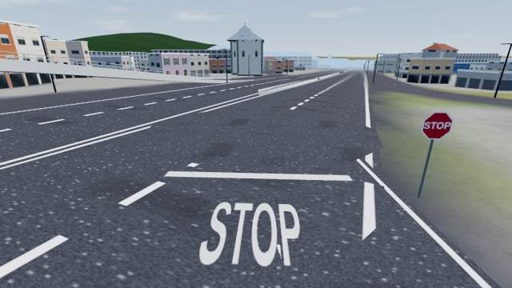 |
| 🆕 | 780 | 3438 | tertiary (#398) | riesgo | en coche | El coche va 1.2 m por encima de la calzada | 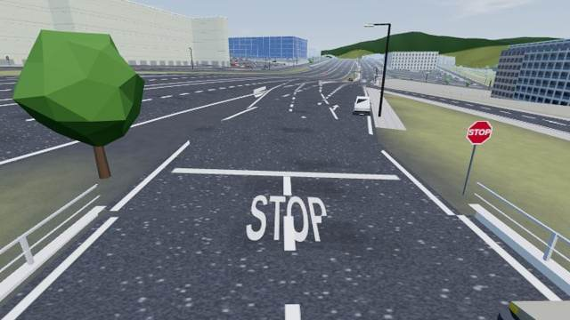 |
| 🆕 | 750 | 3487 | motorway_link (#399) | riesgo | en coche | El coche va 1.2 m por encima de la calzada | 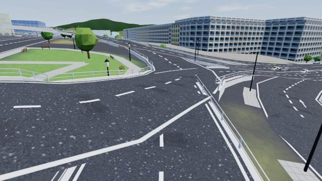 |
| 🆕 | 662 | 3432 | Travesía Enlace Andenes Sobradillo (#650) | riesgo | en coche | El coche va 1.0 m por encima de la calzada | 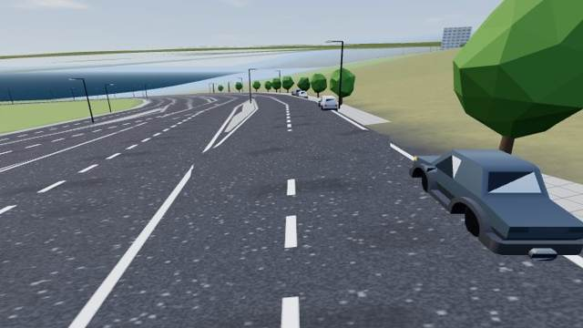 |
| 🆕 | 159 | 1198 | secondary (#660) | riesgo | en coche | El coche va 1.1 m por encima de la calzada | 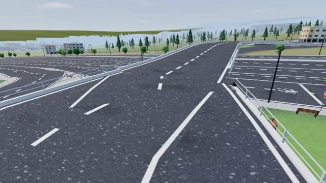 |
| 🆕 | 173 | 1191 | secondary (#694) | riesgo | en coche | El coche va 1.0 m por encima de la calzada | 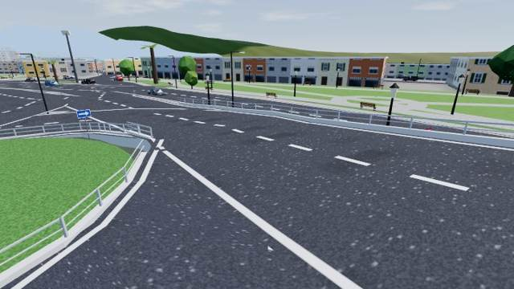 |
| 🆕 | 721 | 3388 | motorway_link (#824) | riesgo | en coche | El coche va 1.1 m por encima de la calzada | 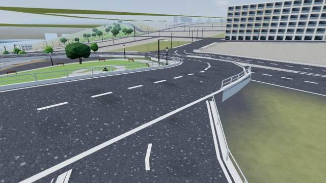 |
| 🆕 | 802 | 3475 | Avenida Ghandi (#1225) | riesgo | en coche | El coche va 1.0 m por encima de la calzada | 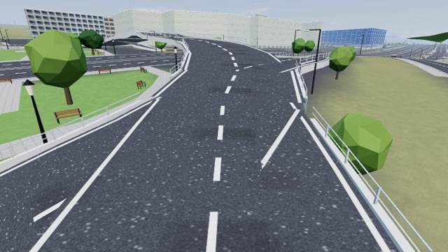 |
| 🆕 | 2219 | 3542 | motorway_link (#2333) | riesgo | en coche | El coche va 1.1 m por encima de la calzada | 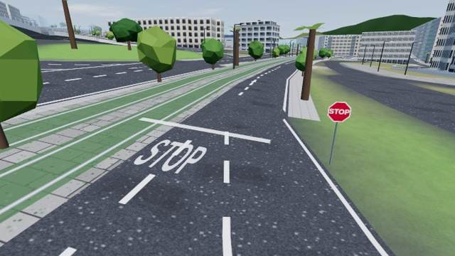 |
| 🆕 | 686 | 3384 | tertiary (#2421) | riesgo | en coche | El coche va 1.3 m por encima de la calzada | 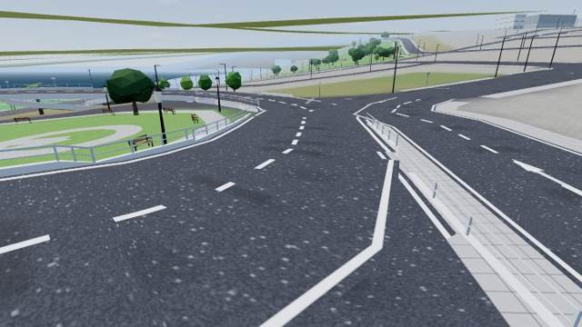 |
| 🆕 | 1179 | 2326 | tertiary (#2547) | riesgo | en coche | El coche va 1.0 m por encima de la calzada | 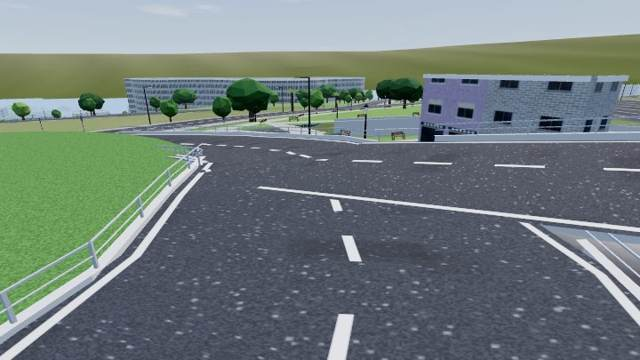 |
| 🆕 | 86 | 1292 | secondary (#3532) | riesgo | en coche | El coche va 1.4 m por encima de la calzada | 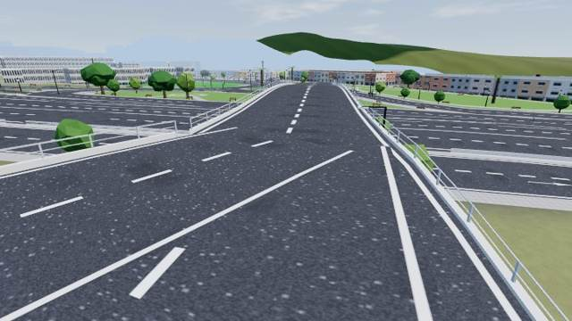 |
| 🆕 | -2251 | -266 | secondary (#4686) | riesgo | en coche | El coche va 1.0 m por encima de la calzada | 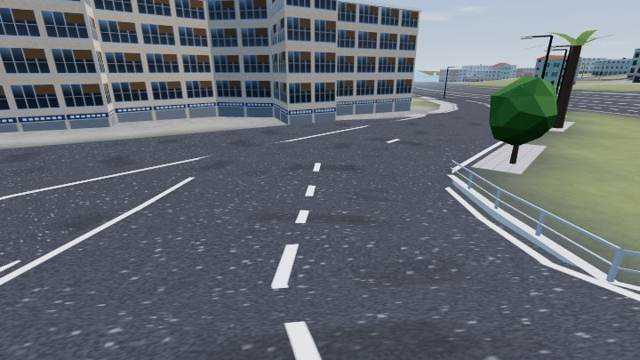 |
| 🆕 | -2274 | -282 | Carretera General del Norte (#4728) | riesgo | en coche | El coche va 1.5 m por encima de la calzada | 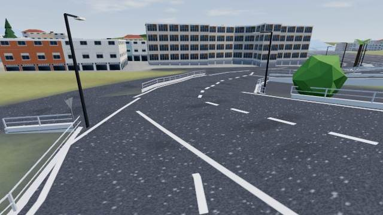 |
| 🆕 | 323 | 240 | Calle Ladera de San Roque (#843) | rotación | en coche | El coche va 1.5 m por encima de la calzada | 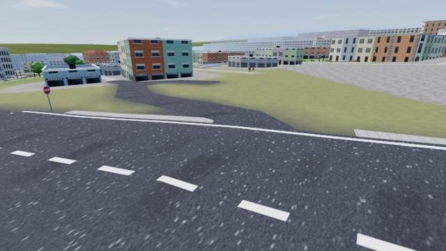 |
| 🆕 | 742 | 840 | primary_link (#668) | zona nueva | en coche | El coche va 2.5 m por encima de la calzada | 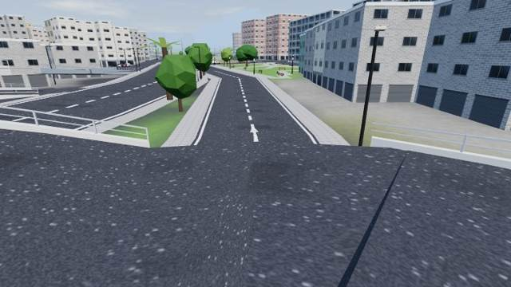 |
| 🆕 | 702 | 813 | residential (#1527) | zona nueva | en coche | El coche va 3.7 m por encima de la calzada | 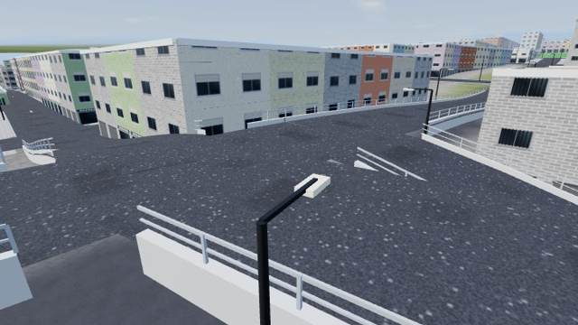 |
| ↻ | 674 | 3445 | motorway_link (#651) | riesgo | en coche | El coche va 1.0 m por encima de la calzada | 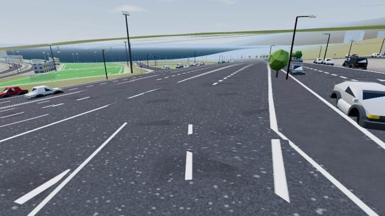 |
| ↻ | 2226 | 3568 | motorway_link (#718) | riesgo | en coche | El coche va 1.4 m por encima de la calzada | 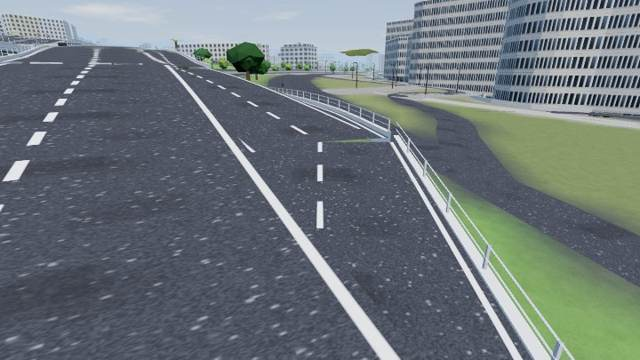 |
| ↻ | 1174 | 2433 | motorway_link (#728) | riesgo | en coche | El coche va 1.2 m por encima de la calzada | 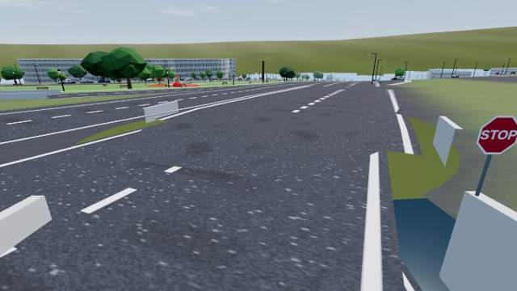 |
| ↻ | 318 | 231 | primary_link (#840) | riesgo | en coche | El coche va 2.3 m por encima de la calzada | 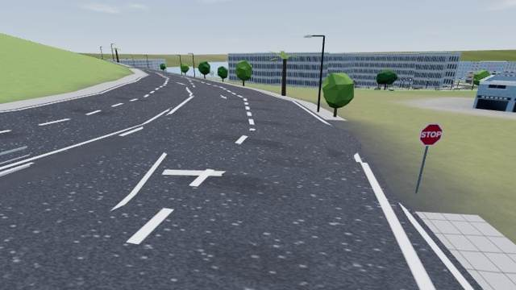 |
| ↻ | 2203 | 3575 | motorway_link (#1304) | riesgo | en coche | El coche va 1.0 m por encima de la calzada | 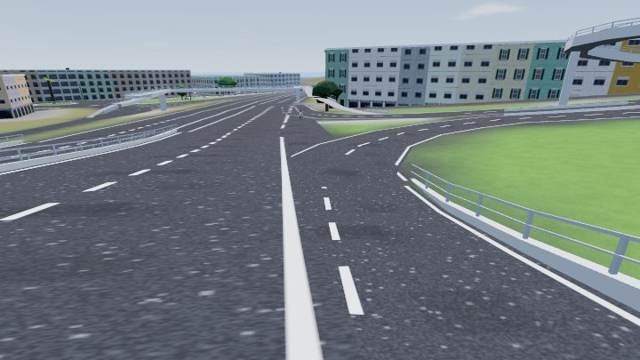 |
| ↻ | 2199 | 3565 | Autopista del Norte (#1306) | riesgo | en coche | El coche va 1.0 m por encima de la calzada | 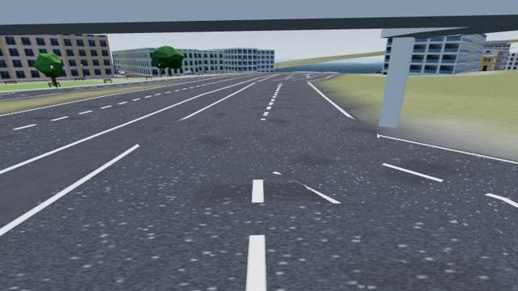 |
| ↻ | -838 | 1351 | Carretera de La Esperanza (#1369) | riesgo | en coche | El coche va 1.4 m por encima de la calzada | 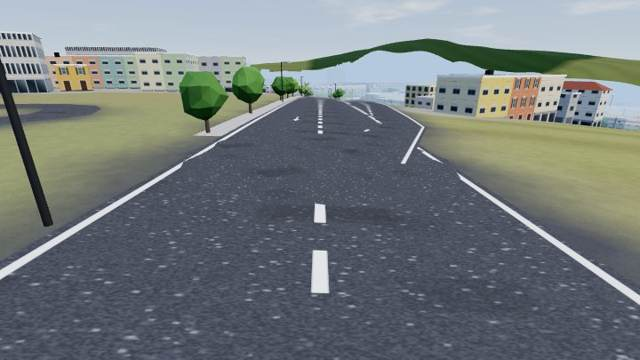 |
| ↻ | 407 | -311 | primary_link (#1607) | riesgo | en coche | El coche va 1.6 m por encima de la calzada | 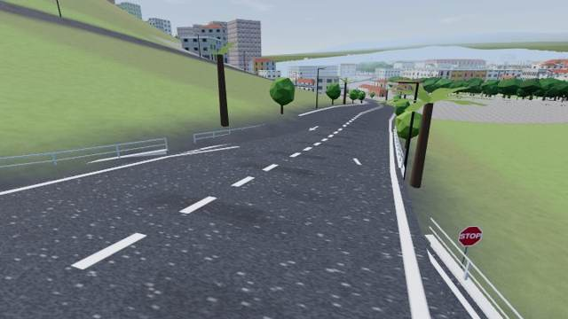 |
| ↻ | 401 | -294 | primary_link (#1608) | riesgo | en coche | El coche va 1.0 m por encima de la calzada | 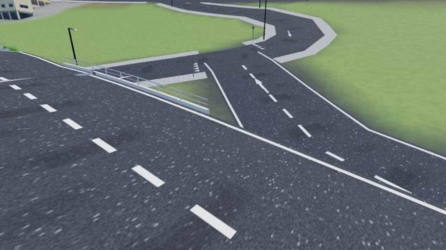 |
| ↻ | 441 | -343 | Vía de Ronda de La Laguna (#1609) | riesgo | en coche | El coche va 1.0 m por encima de la calzada | 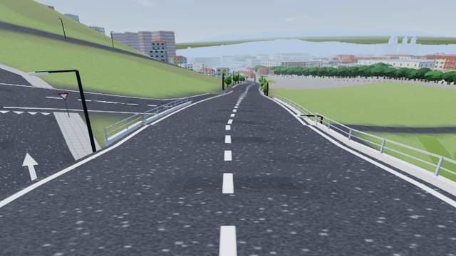 |
| ↻ | 419 | -316 | Vía de Ronda de La Laguna (#1610) | riesgo | en coche | El coche va 1.0 m por encima de la calzada | 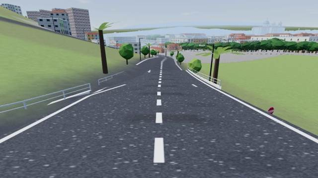 |
| ↻ | 328 | 18 | Vía de Ronda de La Laguna (#1975) | riesgo | en coche | El coche va 1.1 m por encima de la calzada | 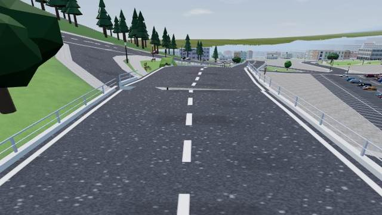 |
| ↻ | 2226 | 3568 | Autopista del Norte (#2320) | riesgo | en coche | El coche va 1.3 m por encima de la calzada | 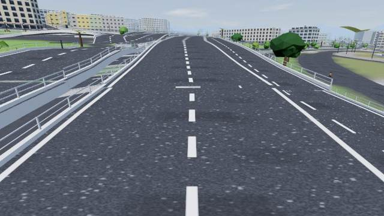 |
| ↻ | 2238 | 3582 | Autopista del Norte (#2322) | riesgo | en coche | El coche va 1.0 m por encima de la calzada | 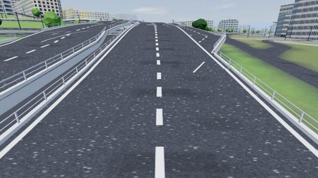 |
| ↻ | 780 | 3440 | tertiary (#2428) | riesgo | en coche | El coche va 1.2 m por encima de la calzada | 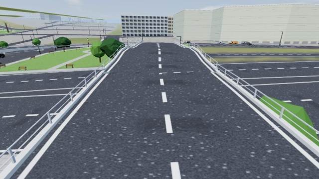 |
| ↻ | 778 | 3464 | tertiary (#2430) | riesgo | en coche | El coche va 1.0 m por encima de la calzada | 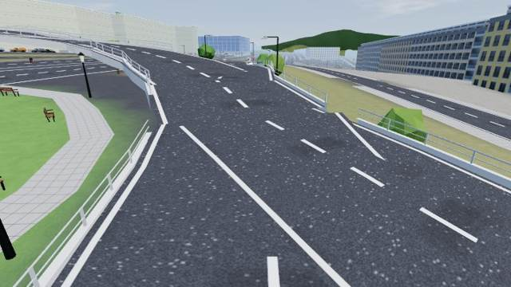 |
| ↻ | 330 | 95 | Vía de Ronda de La Laguna (#2566) | riesgo | en coche | El coche va 1.1 m por encima de la calzada | 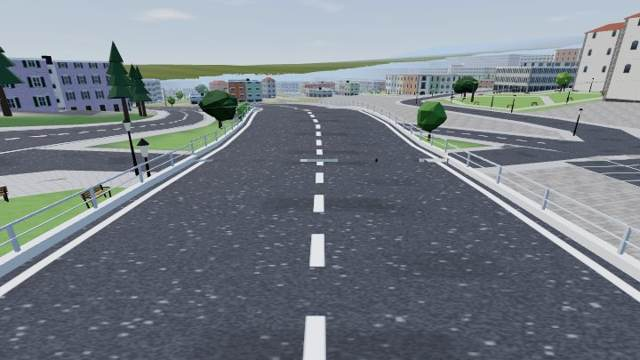 |
| ↻ | -495 | 683 | service (#2696) | riesgo | en coche | El coche va 1.3 m por encima de la calzada | 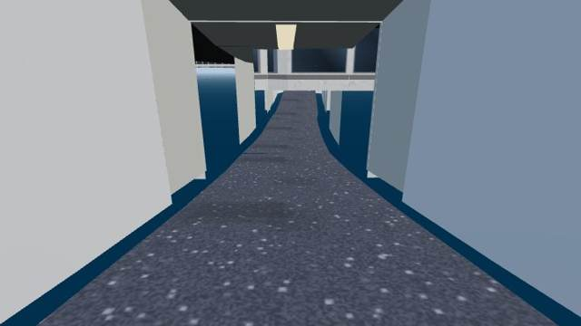 |
| ↻ | -381 | 819 | primary_link (#3612) | riesgo | en coche | El coche va 1.1 m por encima de la calzada | 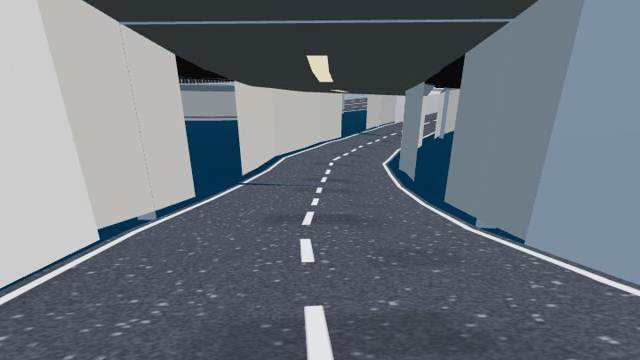 |
| ↻ | 2192 | 3558 | Autopista del Norte (#4544) | riesgo | en coche | El coche va 1.0 m por encima de la calzada | 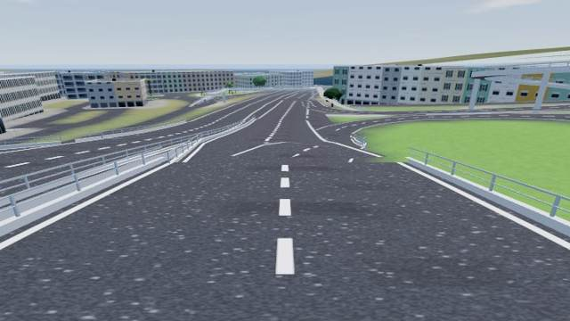 |
| ↻ | 2161 | 3524 | Autopista del Norte (#4545) | riesgo | en coche | El coche va 1.1 m por encima de la calzada | 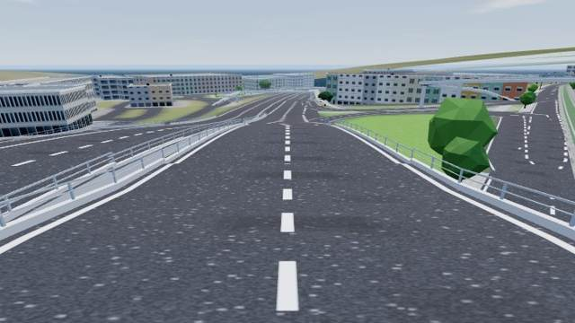 |
| ↻ | -2301 | -235 | primary (#4732) | riesgo | en coche | El coche va 1.1 m por encima de la calzada | 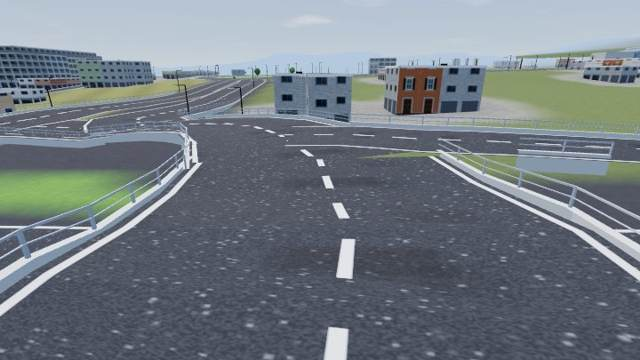 |
| ↻ | -2270 | -257 | primary (#4857) | riesgo | en coche | El coche va 1.0 m por encima de la calzada | 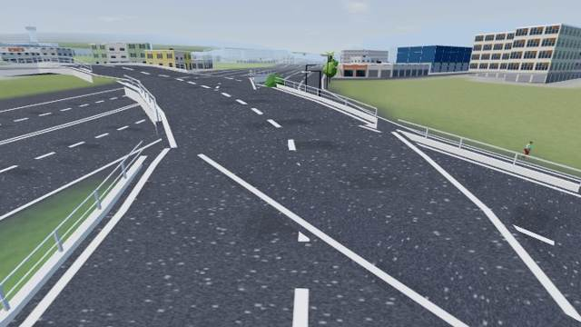 |
| ↻ | 742 | 842 | unclassified (#2410) | zona nueva | en coche | El coche va 1.4 m por encima de la calzada | 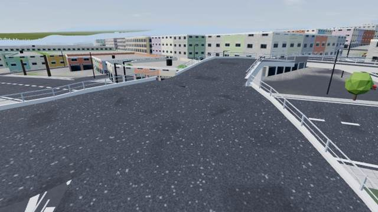 |
| ↻ | -3247 | -359 | service (#5051) | zona nueva | en coche | El coche va 1.6 m por encima de la calzada | 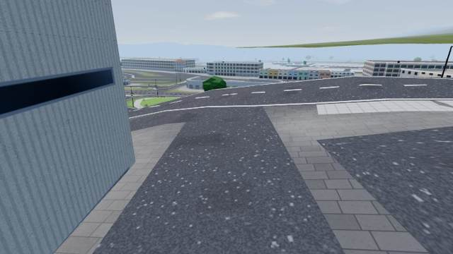 |

## Atascos (40)

| | X | Z | Vía | Pasada | Prueba | Detalle | Captura |
|---|---|---|---|---|---|---|---|
| 🆕 | -179 | -1250 | Calle Enrique Romeu Palazuelos (#638) | rotación | en coche | El coche se queda atascado | 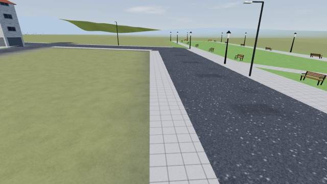 |
| 🆕 | 2400 | 2685 | Calle las Pirámides (#685) | rotación | en coche | El coche se queda atascado | 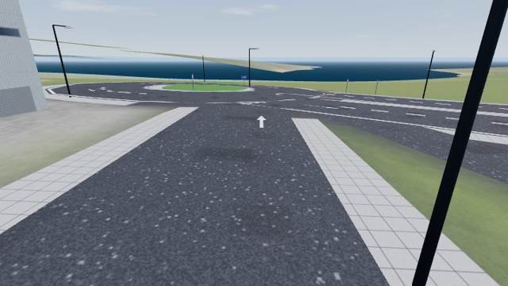 |
| 🆕 | 391 | 1504 | tertiary (#723) | rotación | en coche | El coche se queda atascado | 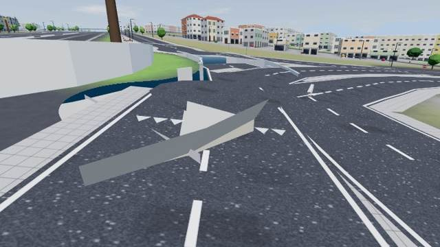 |
| 🆕 | 2058 | 3980 | Carretera General La Cuesta - Taco (#806) | rotación | en coche | El coche se queda atascado | 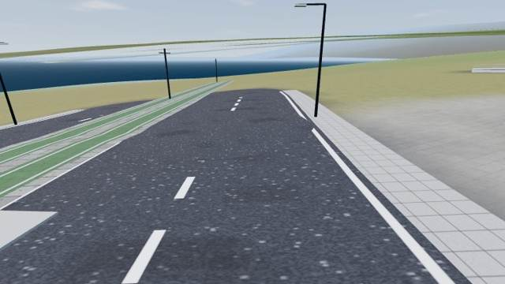 |
| 🆕 | 325 | 241 | Calle Ladera de San Roque (#843) | rotación | en coche | El coche se queda atascado |  |
| 🆕 | 688 | 3980 | Calle Calderon de la Barca (#849) | rotación | en coche | El coche se queda atascado | 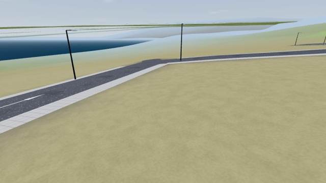 |
| 🆕 | 733 | 3980 | Calle Ponce de León (#851) | rotación | en coche | El coche se queda atascado | 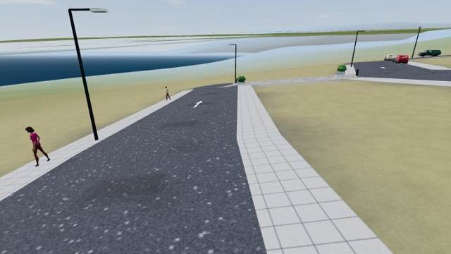 |
| 🆕 | 2400 | 2937 | Calle Gambia (#947) | rotación | en coche | El coche se queda atascado | 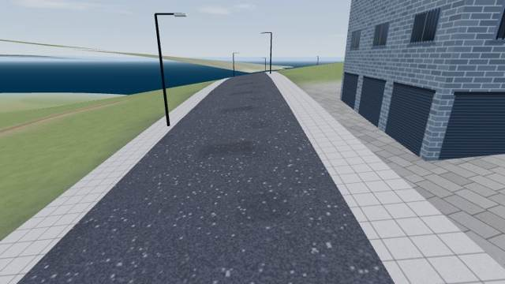 |
| 🆕 | 293 | -1250 | Calle Atolón del Coral (#972) | rotación | en coche | El coche se queda atascado | 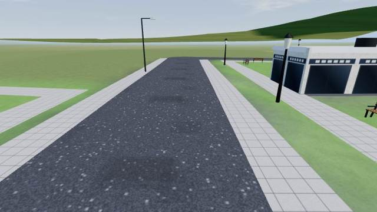 |
| 🆕 | -1616 | -280 | residential (#975) | rotación | en coche | El coche se queda atascado contra un obstáculo/muro | 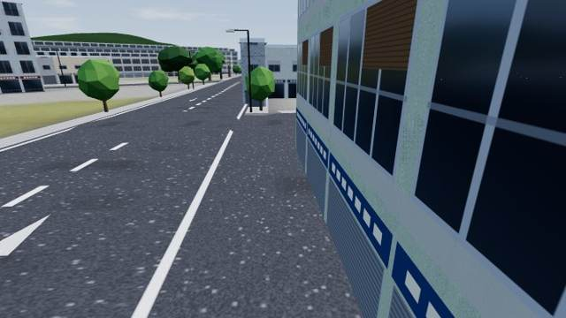 |
| 🆕 | -241 | -1250 | residential (#978) | rotación | en coche | El coche se queda atascado contra un obstáculo/muro | 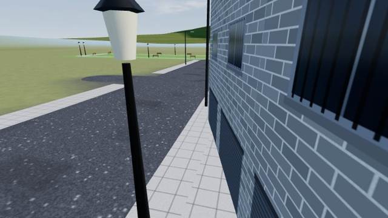 |
| 🆕 | 2400 | 2041 | Avenida de los Menceyes (#1044) | rotación | en coche | El coche se queda atascado | 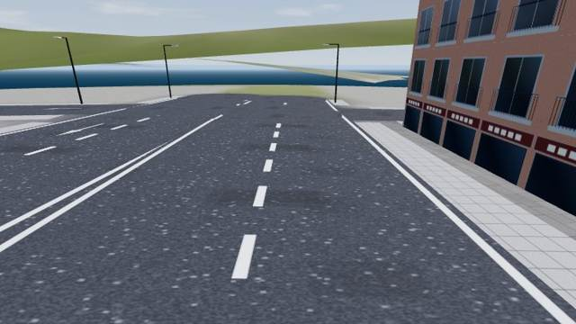 |
| 🆕 | 2243 | 3253 | footway (#1938) | rotación | a pie | El personaje se queda atascado andando por el camino | 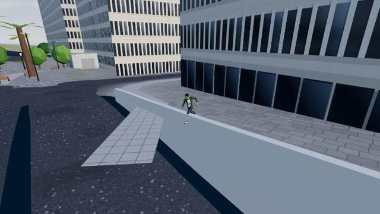 |
| 🆕 | 2206 | 3366 | steps (#1949) | rotación | a pie | El personaje se queda atascado andando por el camino | 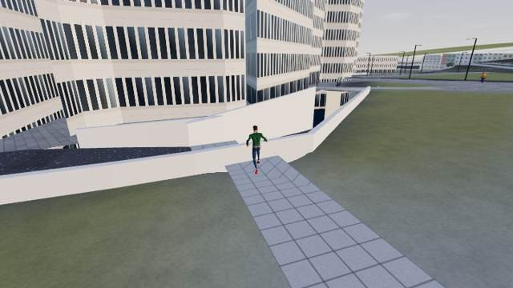 |
| 🆕 | 1897 | 1377 | Pasaje Ancor (#2086) | rotación | a pie | El personaje se queda atascado andando por el camino | 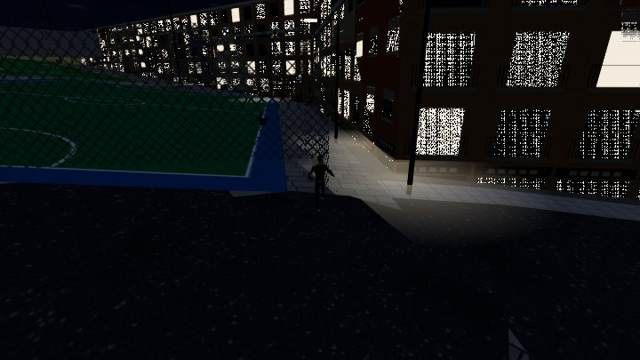 |
| 🆕 | 741 | 837 | primary_link (#668) | zona nueva | en coche | El coche se queda atascado |  |
| 🆕 | 697 | 836 | residential (#1527) | zona nueva | en coche | El coche se queda atascado |  |
| 🆕 | 746 | 865 | footway (#4136) | zona nueva | a pie | El personaje se queda atascado andando por el camino | 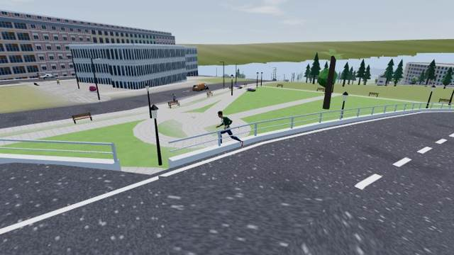 |
| 🆕 | -3144 | -10 | footway (#5089) | zona nueva | a pie | El personaje se queda atascado andando por el camino | 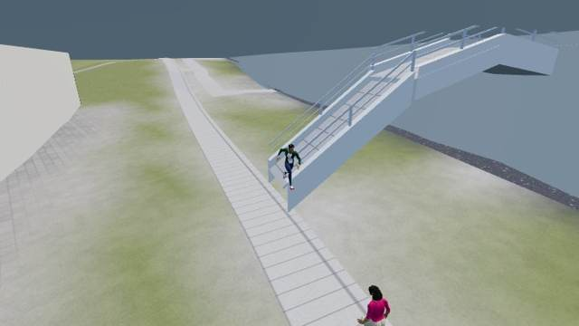 |
| ↻ | 2151 | 3200 | unclassified (#364) | riesgo | en coche | El coche se queda atascado | 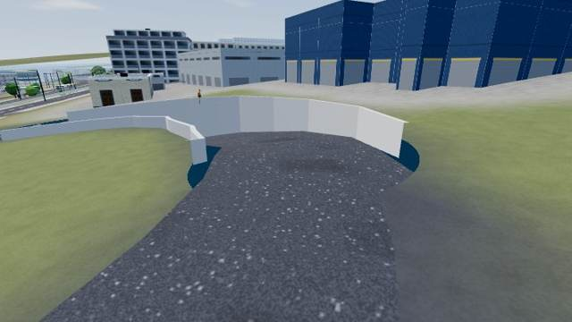 |
| ↻ | 375 | 1456 | Vía de Ronda de La Laguna (#446) | riesgo | en coche | El coche se queda atascado | 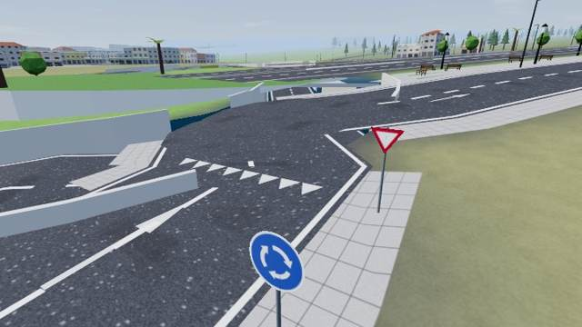 |
| ↻ | 392 | 1475 | Vía de Ronda de La Laguna (#724) | riesgo | en coche | El coche se queda atascado | 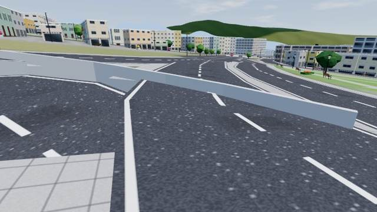 |
| ↻ | 1823 | 3077 | tertiary (#913) | riesgo | en coche | El coche se queda atascado | 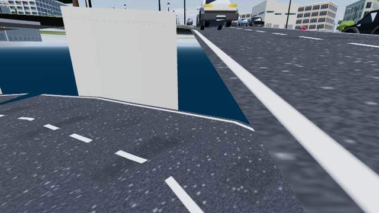 |
| ↻ | 1802 | 3160 | tertiary (#932) | riesgo | en coche | El coche se queda atascado | 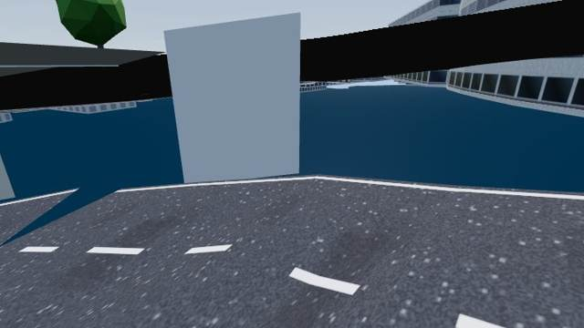 |
| ↻ | 734 | 1288 | Vía de Ronda de La Laguna (#1022) | riesgo | en coche | El coche se queda atascado | 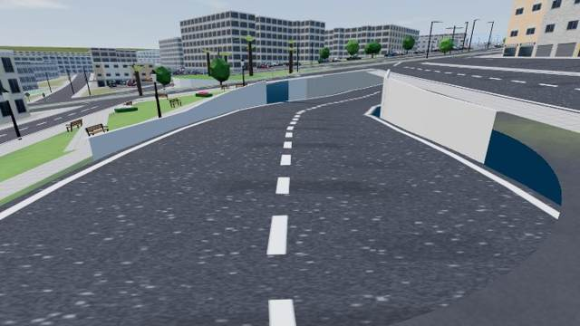 |
| ↻ | 1987 | 3980 | service (#1580) | riesgo | en coche | El coche se queda atascado | 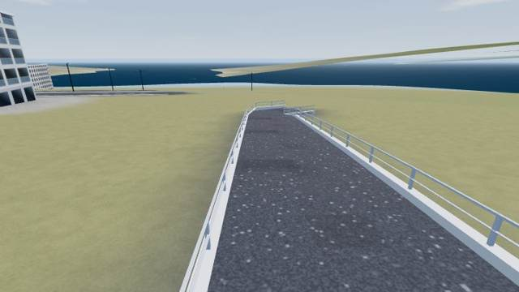 |
| ↻ | 429 | -321 | primary_link (#1608) | riesgo | en coche | El coche se queda atascado |  |
| ↻ | 1766 | 3140 | tertiary (#2250) | riesgo | en coche | El coche se queda atascado | 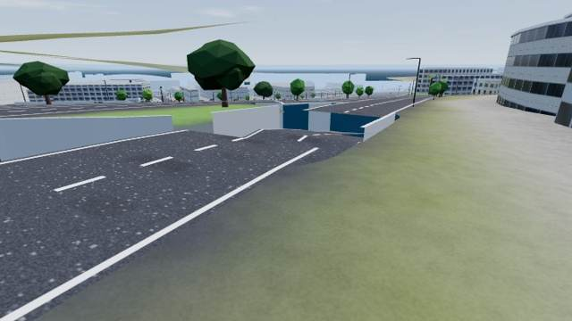 |
| ↻ | 302 | 1536 | primary (#2415) | riesgo | en coche | El coche se queda atascado | 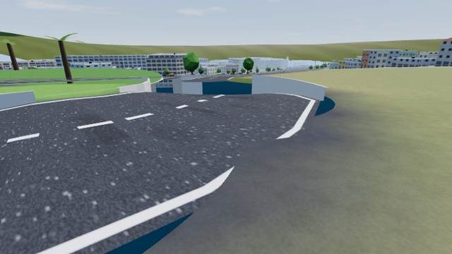 |
| ↻ | 1943 | 3057 | service (#3018) | riesgo | en coche | El coche se queda atascado | 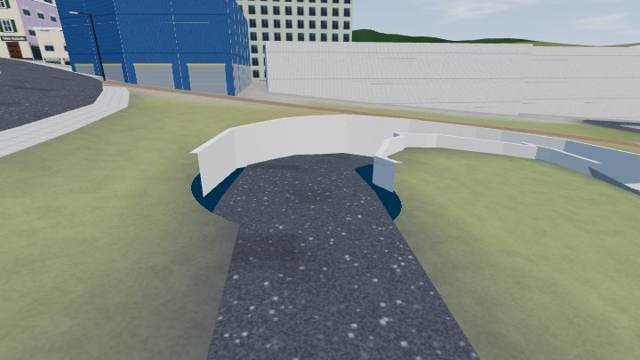 |
| ↻ | 797 | 3132 | Calle Aceviño (#3192) | riesgo | en coche | El coche se queda atascado | 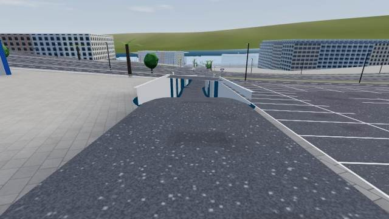 |
| ↻ | 1447 | 1131 | Calle Castellón (#533) | zona nueva | en coche | El coche se queda atascado | 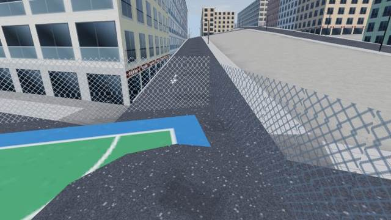 |
| ↻ | 933 | 639 | Calle Miguel Hernández (#1935) | zona nueva | en coche | El coche se queda atascado contra un obstáculo/muro | 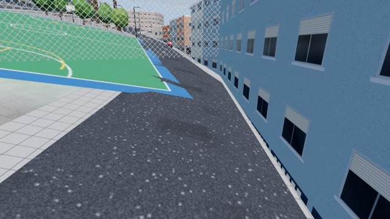 |
| ↻ | -948 | 1484 | Calle La Papa (#3109) | zona nueva | en coche | El coche se queda atascado contra un obstáculo/muro | 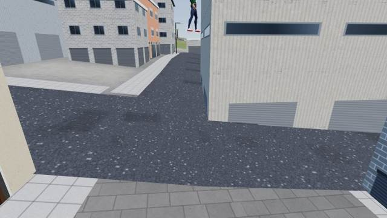 |
| ↻ | 5 | 2330 | service (#3522) | zona nueva | en coche | El coche se queda atascado | 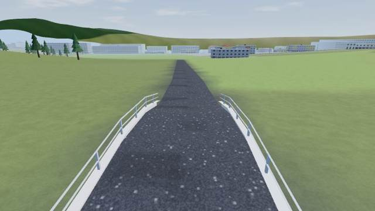 |
| ↻ | -3086 | -142 | service (#4757) | zona nueva | en coche | El coche se queda atascado | 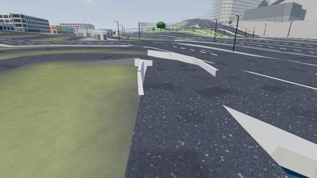 |
| ↻ | -3052 | 39 | footway (#5095) | zona nueva | a pie | El personaje se queda atascado andando por el camino | 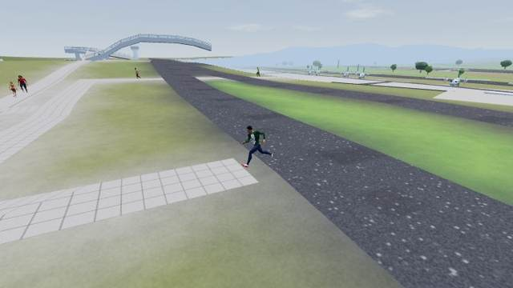 |
| ↻ | -3146 | 84 | footway (#5155) | zona nueva | a pie | El personaje se queda atascado andando por el camino | 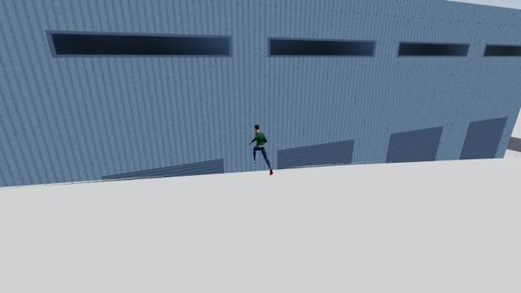 |
| ↻ | -3150 | 101 | footway (#5157) | zona nueva | a pie | El personaje se queda atascado andando por el camino | 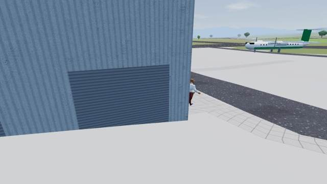 |
| ↻ | -3162 | -3 | footway (#5162) | zona nueva | a pie | El personaje se queda atascado andando por el camino | 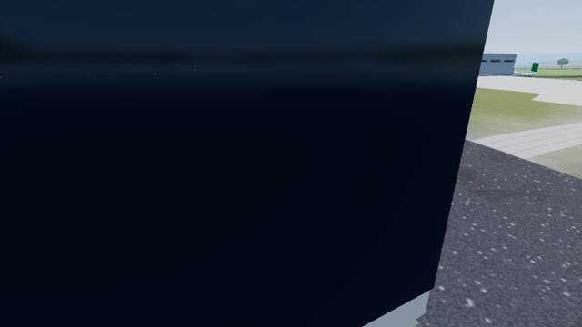 |

## Se hunde (23)

| | X | Z | Vía | Pasada | Prueba | Detalle | Captura |
|---|---|---|---|---|---|---|---|
| 🆕 | 1544 | 2731 | tertiary (#895) | rotación | en coche | El coche va 1.0 m por debajo de la calzada | 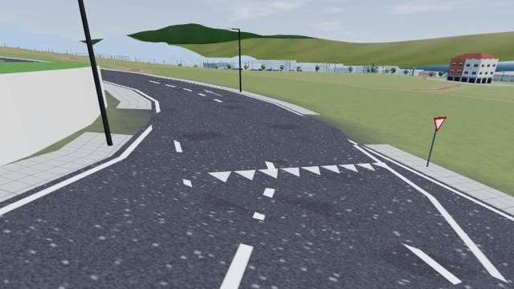 |
| 🆕 | -291 | 2699 | footway (#876) | zona nueva | a pie | El personaje se hunde 0.68 m bajo la superficie visible (suelo) | 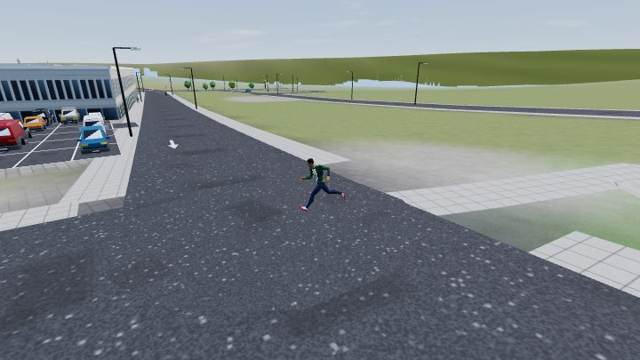 |
| 🆕 | 972 | 1089 | footway (#2787) | zona nueva | a pie | El personaje se hunde 0.26 m bajo la superficie visible (suelo) | 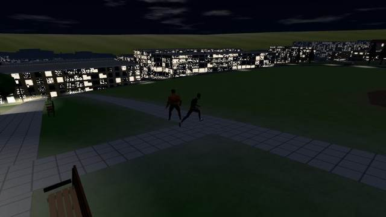 |
| 🆕 | 755 | 1263 | footway (#4136) | zona nueva | a pie | El personaje se hunde 1.09 m bajo la superficie visible (asphaltLines) |  |
| 🆕 | -2939 | 90 | footway (#5086) | zona nueva | a pie | El personaje se hunde 0.60 m bajo la superficie visible (footway) | 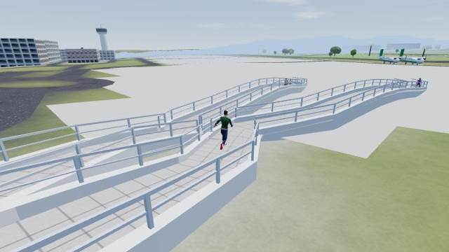 |
| 🆕 | -3079 | 15 | footway (#5089) | zona nueva | a pie | El personaje se hunde 0.27 m bajo la superficie visible (suelo) |  |
| 🆕 | -2971 | 70 | footway (#5107) | zona nueva | a pie | El personaje se hunde 0.30 m bajo la superficie visible (asphalt) | 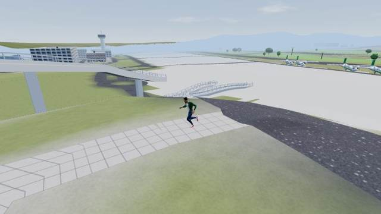 |
| ↻ | 501 | 1386 | Vía de Ronda de La Laguna (#443) | riesgo | en coche | El coche va 0.5 m por debajo de la calzada | 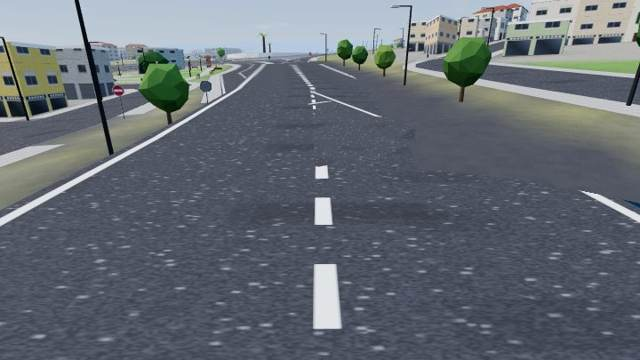 |
| ↻ | 389 | 1487 | Vía de Ronda de La Laguna (#724) | riesgo | en coche | El coche va 2.4 m por debajo de la calzada |  |
| ↻ | 1837 | 3084 | tertiary (#913) | riesgo | en coche | El coche va 1.6 m por debajo de la calzada |  |
| ↻ | 1846 | 3102 | tertiary (#922) | riesgo | en coche | El coche va 0.5 m por debajo de la calzada | 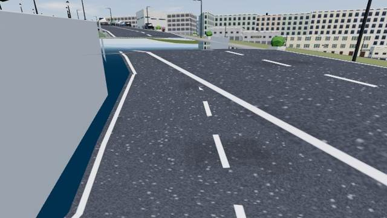 |
| ↻ | 1785 | 3153 | tertiary (#932) | riesgo | en coche | El coche va 1.1 m por debajo de la calzada |  |
| ↻ | 1854 | 3104 | tertiary (#1311) | riesgo | en coche | El coche va 1.4 m por debajo de la calzada | 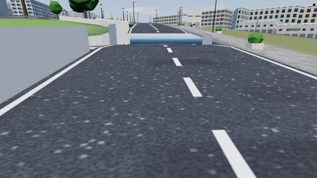 |
| ↻ | 385 | 1477 | primary (#2386) | riesgo | en coche | El coche va 0.5 m por debajo de la calzada | 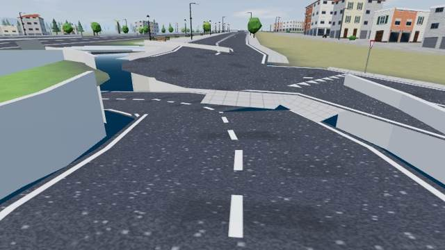 |
| ↻ | 307 | 1536 | primary (#2415) | riesgo | en coche | El coche va 0.5 m por debajo de la calzada |  |
| ↻ | -975 | 121 | tertiary (#3046) | riesgo | en coche | El coche va 0.7 m por debajo de la calzada | 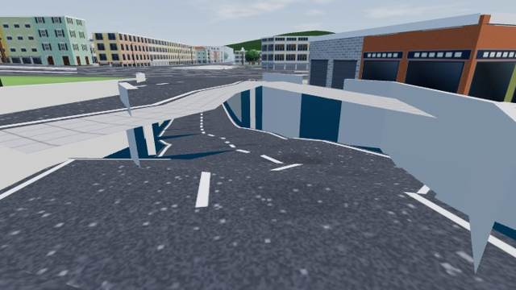 |
| ↻ | -394 | 834 | primary_link (#3612) | riesgo | en coche | El coche va 0.7 m por debajo de la calzada |  |
| ↻ | 1433 | 1661 | secondary (#3688) | riesgo | en coche | El coche va 0.6 m por debajo de la calzada | 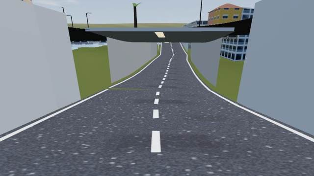 |
| ↻ | -3869 | -359 | service (#5126) | riesgo | en coche | El coche va 0.5 m por debajo de la calzada | 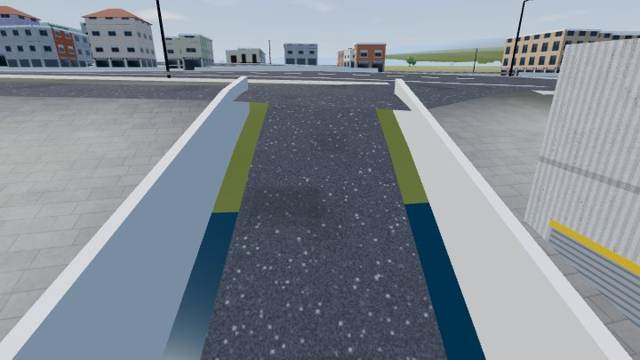 |
| ↻ | 685 | 440 | footway (#2270) | zona nueva | a pie | El personaje se hunde 0.40 m bajo la superficie visible (suelo) | 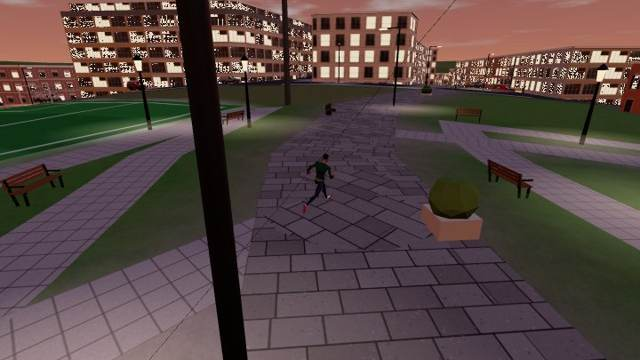 |
| ↻ | -3087 | 16 | footway (#5099) | zona nueva | a pie | El personaje se hunde 0.83 m bajo la superficie visible (suelo) | 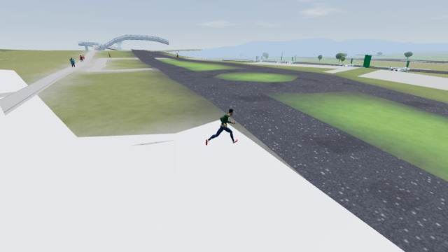 |
| ↻ | -3062 | 15 | footway (#5103) | zona nueva | a pie | El personaje se hunde 0.25 m bajo la superficie visible (suelo) | 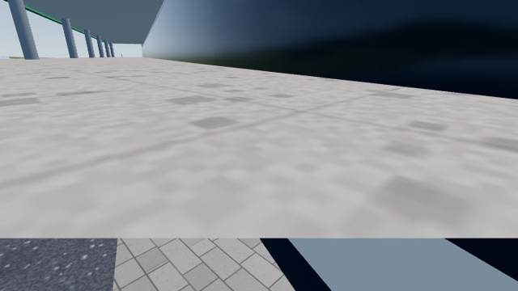 |
| ↻ | -2983 | 104 | footway (#5164) | zona nueva | a pie | El personaje se hunde 0.27 m bajo la superficie visible (footway) | 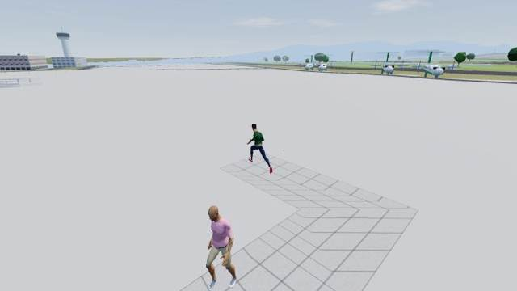 |

## Objetos flotando sobre la calzada (20)

| | X | Z | Vía | Pasada | Prueba | Detalle | Captura |
|---|---|---|---|---|---|---|---|
| 🆕 | -2225 | -213 | motorway_link (#307) | riesgo | superficies | Algo plano («trim») flota 3.1 m sobre la calzada | 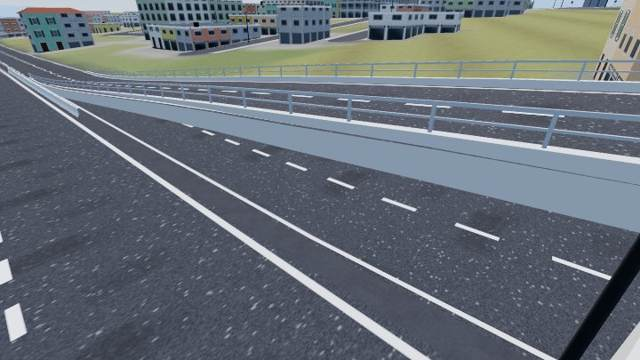 |
| 🆕 | -741 | 334 | tertiary (#979) | riesgo | superficies | Algo plano («asphaltLines») flota 1.9 m sobre la calzada | 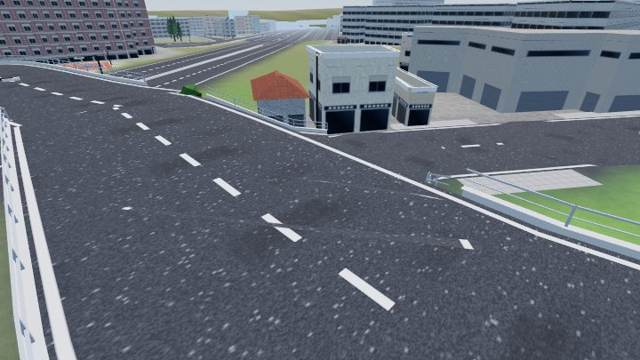 |
| 🆕 | -731 | 335 | Camino San Francisco (#2831) | riesgo | superficies | Algo plano («asphaltLines») flota 2.0 m sobre la calzada | 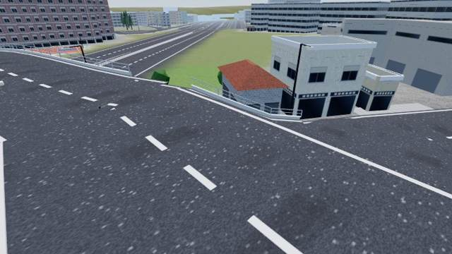 |
| 🆕 | 91 | 1284 | secondary (#3532) | riesgo | superficies | Algo plano («trim») flota 1.9 m sobre la calzada | 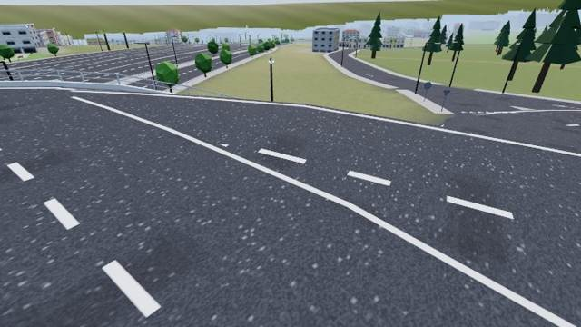 |
| 🆕 | 2286 | 3608 | service (#943) | rotación | superficies | Algo plano («footway») flota 1.1 m sobre la calzada | 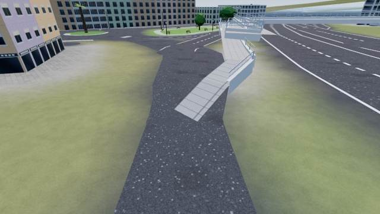 |
| 🆕 | 742 | 838 | primary_link (#668) | zona nueva | superficies | Algo plano («asphalt») flota 1.8 m sobre la calzada | 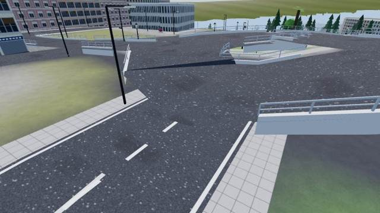 |
| 🆕 | 701 | 814 | residential (#1527) | zona nueva | superficies | Algo plano («trim») flota 2.8 m sobre la calzada | 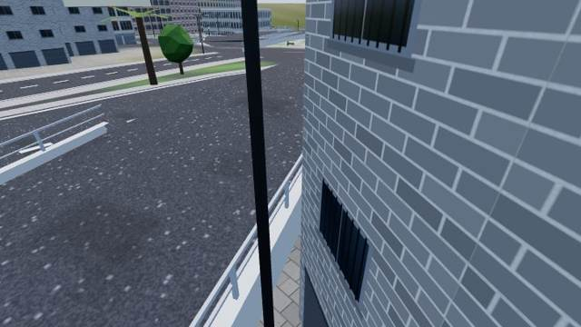 |
| 🆕 | -3250 | -376 | service (#5051) | zona nueva | superficies | Algo plano (objeto #ffffff) flota 0.6 m sobre la calzada | 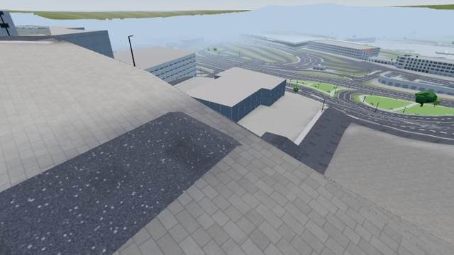 |
| ↻ | 752 | 1268 | primary_link (#19) | riesgo | superficies | Algo plano («asphaltLines») flota 1.0 m sobre la calzada | 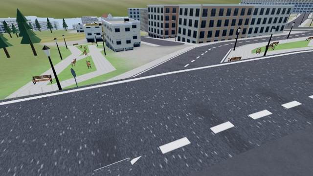 |
| ↻ | 753 | 3484 | motorway_link (#399) | riesgo | superficies | Algo plano («asphaltLines») flota 1.2 m sobre la calzada | 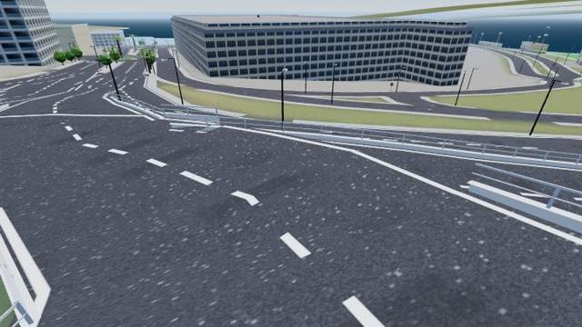 |
| ↻ | 885 | 3177 | tertiary_link (#400) | riesgo | superficies | Algo plano («trim») flota 0.7 m sobre la calzada | 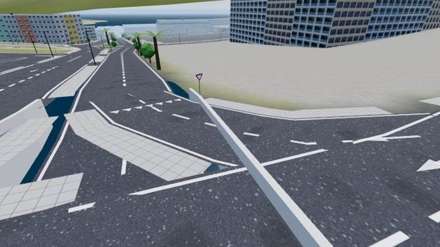 |
| ↻ | 464 | 1421 | primary_link (#813) | riesgo | superficies | Algo plano («asphaltLines») flota 0.8 m sobre la calzada | 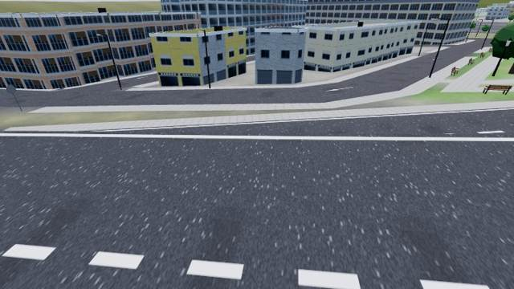 |
| ↻ | 714 | 3392 | motorway_link (#824) | riesgo | superficies | Algo plano («trim») flota 0.7 m sobre la calzada | 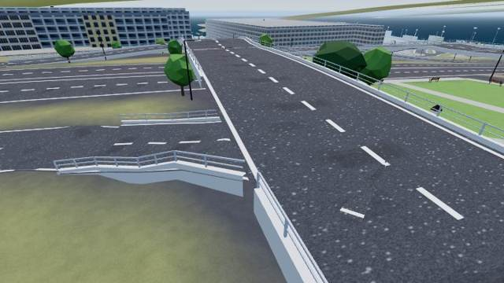 |
| ↻ | 320 | 238 | primary_link (#840) | riesgo | superficies | Algo plano («asphaltLines») flota 1.4 m sobre la calzada | 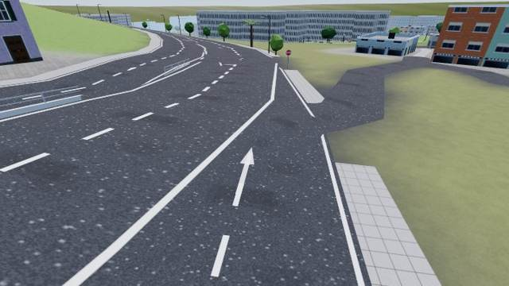 |
| ↻ | 1512 | 1744 | Avenida de los Menceyes (#1052) | riesgo | superficies | Algo plano («trim») flota 0.7 m sobre la calzada | 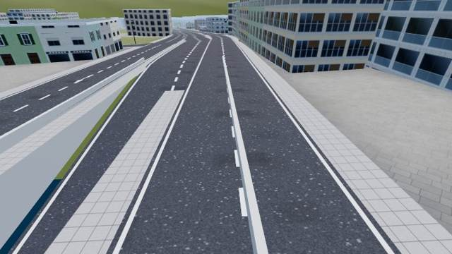 |
| ↻ | 410 | -314 | primary_link (#1607) | riesgo | superficies | Algo plano («trim») flota 3.2 m sobre la calzada | 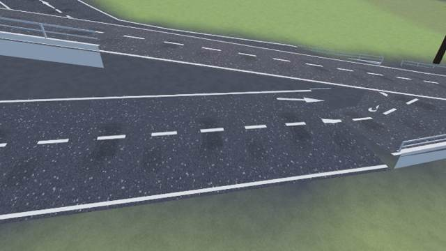 |
| ↻ | -3273 | -237 | secondary_link (#4772) | zona nueva | superficies | Algo plano («trim») flota 0.7 m sobre la calzada | 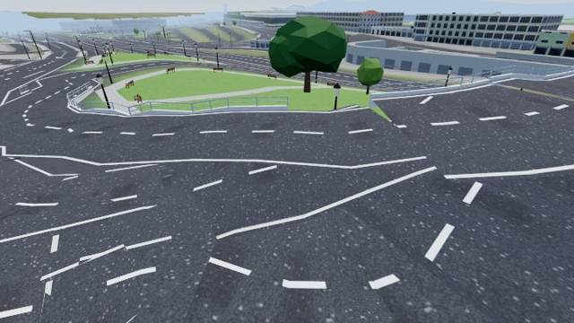 |
| ↻ | -3282 | -233 | secondary (#5016) | zona nueva | superficies | Algo plano («trim») flota 0.8 m sobre la calzada | 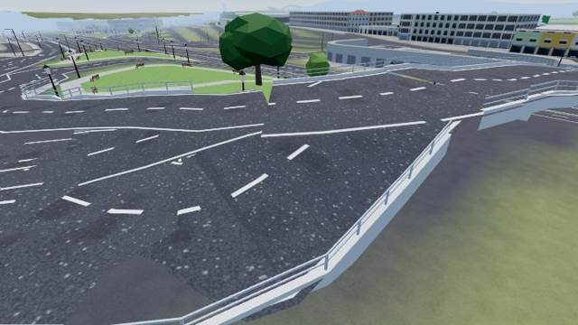 |
| ↻ | -3298 | 100 | service (#5121) | zona nueva | superficies | Algo plano (objeto #1f8a4c) flota 1.7 m sobre la calzada | 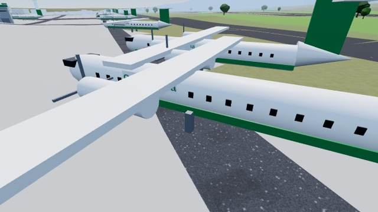 |
| ↻ | -3241 | 122 | service (#5121) | zona nueva | superficies | Algo plano (objeto #f5f5f2) flota 2.5 m sobre la calzada |  |

## Texturas cruzadas (suelo sobre la carretera) (18)

| | X | Z | Vía | Pasada | Prueba | Detalle | Captura |
|---|---|---|---|---|---|---|---|
| 🆕 | -2189 | -214 | motorway_link (#307) | riesgo | superficies | Superficie «trim» 0.18 m por encima del asfalto |  |
| 🆕 | 662 | 3433 | Travesía Enlace Andenes Sobradillo (#650) | riesgo | superficies | Superficie «trim» 0.17 m por encima del asfalto | 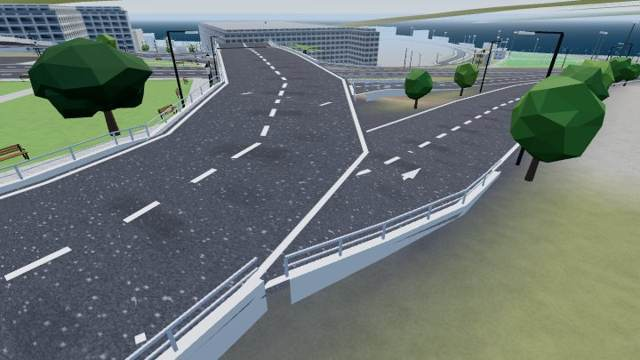 |
| 🆕 | 674 | 3446 | motorway_link (#651) | riesgo | superficies | Superficie «trim» 0.21 m por encima del asfalto | 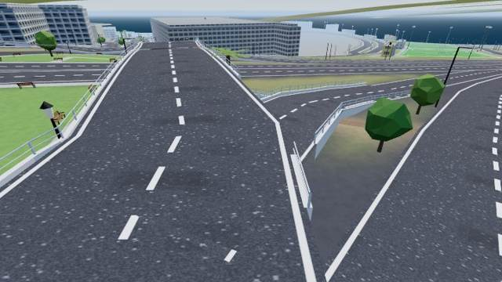 |
| 🆕 | 177 | 1191 | secondary (#694) | riesgo | superficies | Superficie «trim» 0.24 m por encima del asfalto | 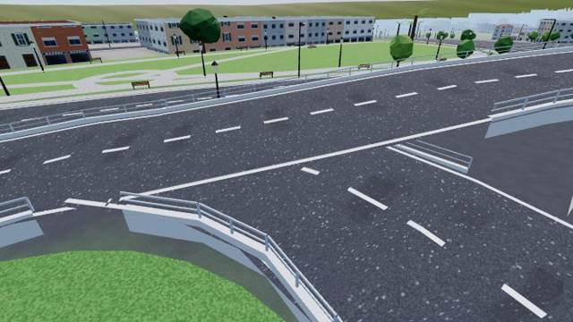 |
| 🆕 | 323 | 242 | primary_link (#840) | riesgo | superficies | Superficie «trim» 0.26 m por encima del asfalto |  |
| 🆕 | 2216 | 3537 | motorway_link (#2333) | riesgo | superficies | Superficie «trim» 0.35 m por encima del asfalto | 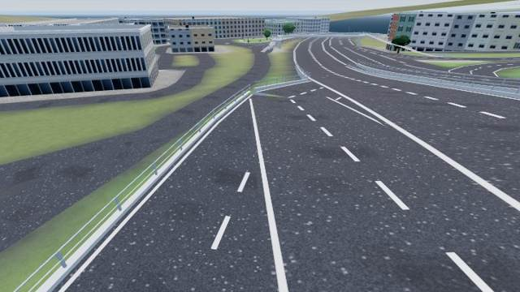 |
| 🆕 | 95 | 1279 | secondary (#3532) | riesgo | superficies | Superficie «trim» 0.28 m por encima del asfalto |  |
| 🆕 | 77 | 1287 | secondary (#3537) | riesgo | superficies | Superficie «trim» 0.23 m por encima del asfalto | 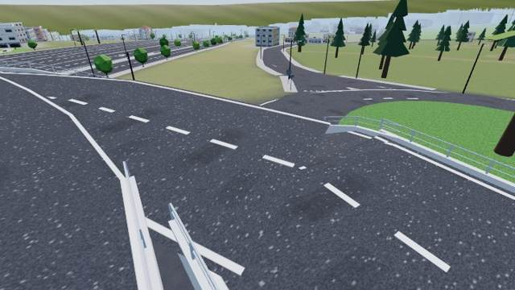 |
| 🆕 | -2273 | -283 | Carretera General del Norte (#4728) | riesgo | superficies | Superficie «trim» 0.11 m por encima del asfalto | 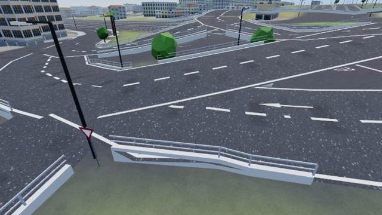 |
| 🆕 | 390 | 1502 | tertiary (#723) | rotación | superficies | Superficie «tunnel» 0.43 m por encima del asfalto | 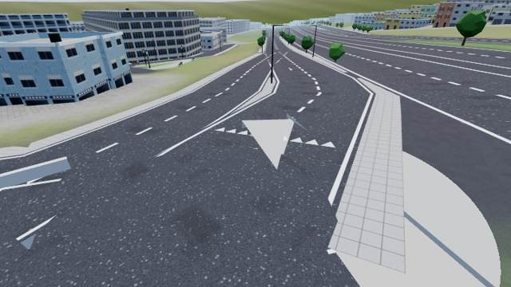 |
| 🆕 | -3223 | -361 | Camino del Púlpito (#4716) | zona nueva | superficies | Superficie objeto #ffffff 0.06 m por encima del asfalto | 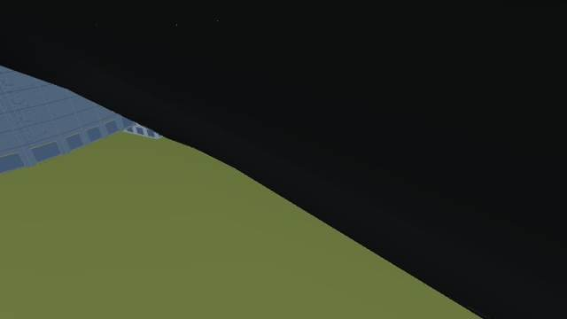 |
| 🆕 | -3407 | -377 | Camino el Yugo (#4752) | zona nueva | superficies | Superficie objeto #ffffff 0.20 m por encima del asfalto | 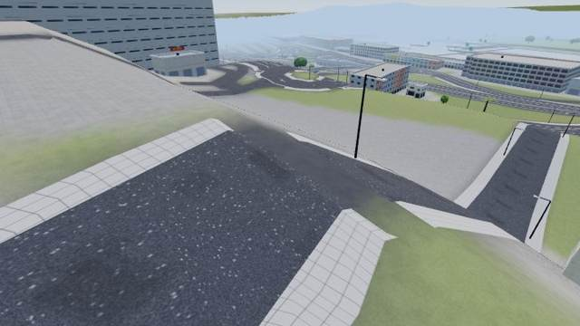 |
| 🆕 | -3274 | -236 | secondary_link (#4772) | zona nueva | superficies | Superficie «trim» 0.19 m por encima del asfalto |  |
| 🆕 | -3346 | -280 | Carretera General del Norte (#4892) | zona nueva | superficies | Superficie objeto #ffffff 0.14 m por encima del asfalto | 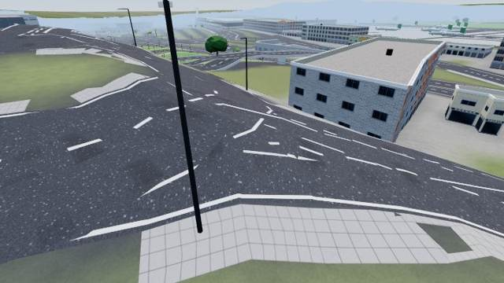 |
| 🆕 | -3164 | -376 | Camino Reja (#4978) | zona nueva | superficies | Superficie objeto #ffffff 0.18 m por encima del asfalto | 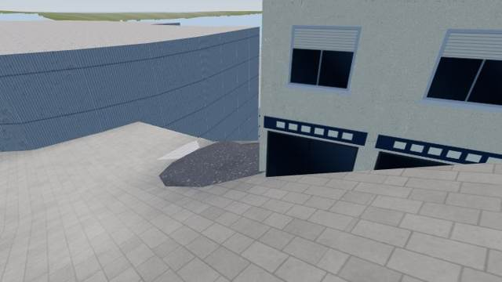 |
| 🆕 | -3288 | -312 | service (#5028) | zona nueva | superficies | Superficie objeto #ffffff 0.08 m por encima del asfalto | 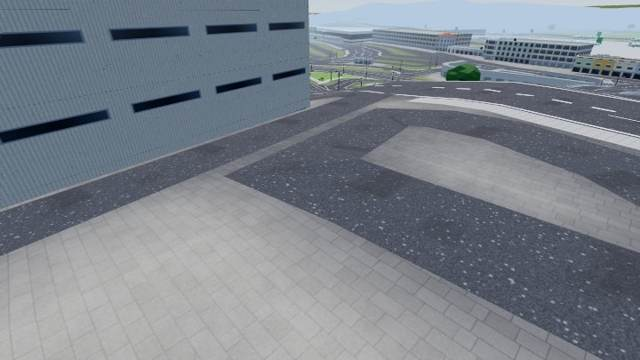 |
| 🆕 | -3256 | -402 | service (#5051) | zona nueva | superficies | Superficie objeto #ffffff 0.06 m por encima del asfalto |  |
| ↻ | -2829 | 431 | service (#4943) | zona nueva | superficies | Superficie aeropuerto #3d3f42 0.05 m por encima del asfalto | 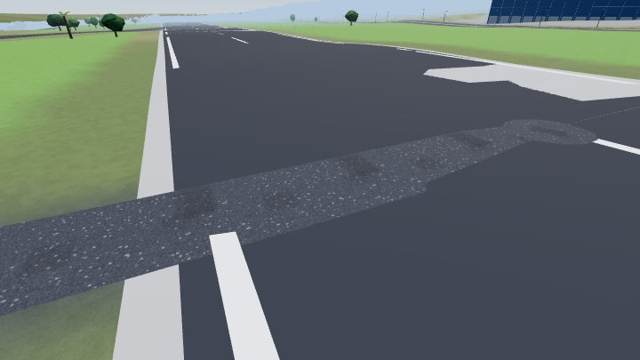 |

## Se sale de la calzada (11)

| | X | Z | Vía | Pasada | Prueba | Detalle | Captura |
|---|---|---|---|---|---|---|---|
| 🆕 | -515 | -740 | Calle Las Eras (#801) | rotación | en coche | El coche se sale de la calzada (7.0 m del eje) | 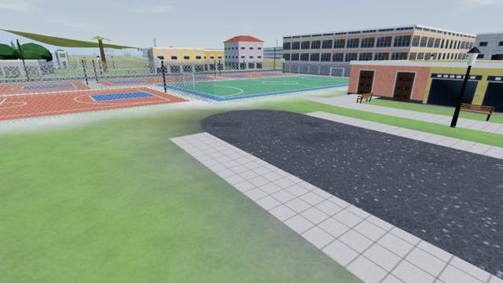 |
| 🆕 | 388 | 490 | service (#808) | rotación | en coche | El coche se sale de la calzada (5.8 m del eje) | 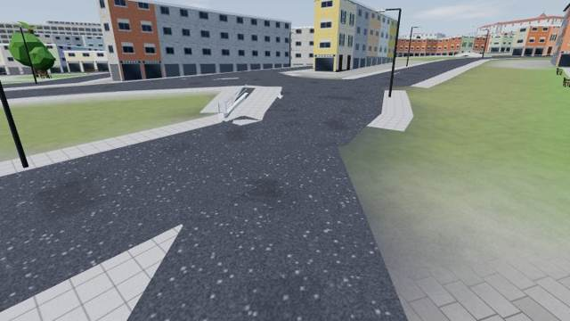 |
| 🆕 | 700 | 3980 | Calle Calderon de la Barca (#849) | rotación | en coche | El coche se sale de la calzada (7.0 m del eje) |  |
| 🆕 | 697 | 833 | residential (#1527) | zona nueva | en coche | El coche se sale de la calzada (7.0 m del eje) |  |
| 🆕 | -2237 | 490 | service (#2857) | zona nueva | en coche | El coche se sale de la calzada (6.0 m del eje) | 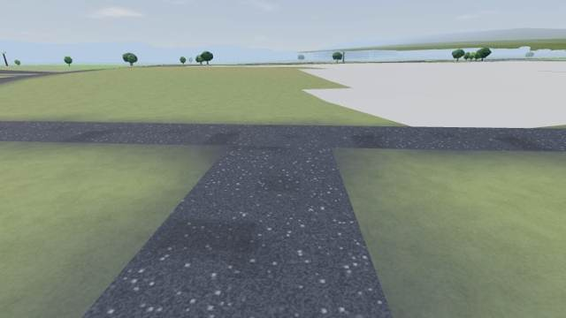 |
| ↻ | 1801 | 3160 | tertiary (#932) | riesgo | en coche | El coche se sale de la calzada (8.2 m del eje) |  |
| ↻ | -214 | 1961 | Calle Fresón (#624) | zona nueva | en coche | El coche se sale de la calzada (7.2 m del eje) | 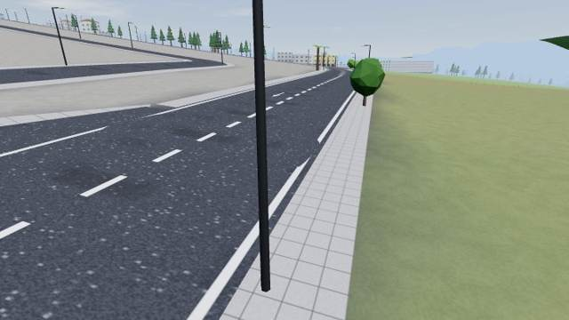 |
| ↻ | -2749 | 53 | residential (#4957) | zona nueva | en coche | El coche se sale de la calzada (7.0 m del eje) | 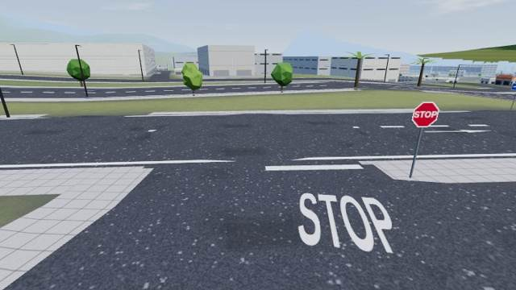 |
| ↻ | -2603 | 97 | service (#4963) | zona nueva | en coche | El coche se sale de la calzada (5.7 m del eje) | 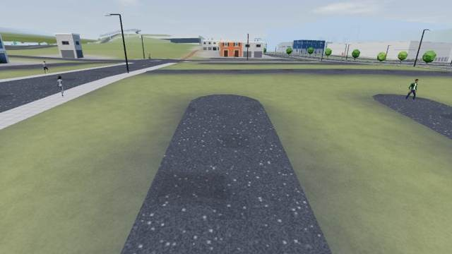 |
| ↻ | -2503 | 16 | service (#4965) | zona nueva | en coche | El coche se sale de la calzada (5.7 m del eje) | 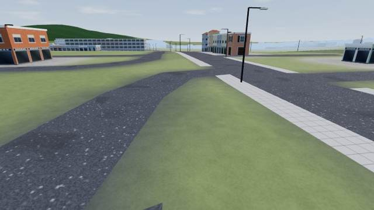 |
| ↻ | -2982 | -240 | service (#4981) | zona nueva | en coche | El coche se sale de la calzada (5.7 m del eje) | 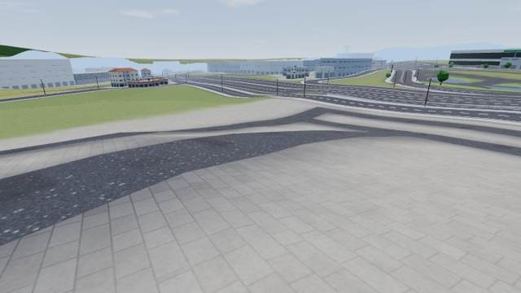 |

## Saltos de altura (7)

| | X | Z | Vía | Pasada | Prueba | Detalle | Captura |
|---|---|---|---|---|---|---|---|
| 🆕 | -2218 | -212 | motorway_link (#307) | riesgo | en coche | Salto brusco de altura (1.3 m en un fotograma) |  |
| 🆕 | 1544 | 2731 | tertiary (#895) | rotación | en coche | Salto brusco de altura (-1.2 m en un fotograma) |  |
| 🆕 | 702 | 813 | residential (#1527) | zona nueva | en coche | Salto brusco de altura (1.8 m en un fotograma) |  |
| ↻ | 318 | 231 | primary_link (#840) | riesgo | en coche | Salto brusco de altura (2.3 m en un fotograma) |  |
| ↻ | 407 | -311 | primary_link (#1607) | riesgo | en coche | Salto brusco de altura (1.4 m en un fotograma) |  |
| ↻ | -495 | 683 | service (#2696) | riesgo | en coche | Salto brusco de altura (-1.2 m en un fotograma) |  |
| ↻ | -3247 | -359 | service (#5051) | zona nueva | en coche | Salto brusco de altura (1.7 m en un fotograma) |  |

## Edificios sobre la vía (7)

| | X | Z | Vía | Pasada | Prueba | Detalle | Captura |
|---|---|---|---|---|---|---|---|
| 🆕 | 543 | -909 | Camino La Rúa (#306) | riesgo | en coche | Un edificio tapa la vía: la calle entra en él (dato de OSM o edificio mal puesto) | 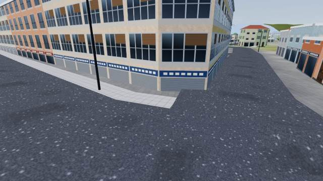 |
| 🆕 | 1018 | 1588 | Calle La Tierra (#2063) | rotación | a pie | Un edificio tapa el camino | 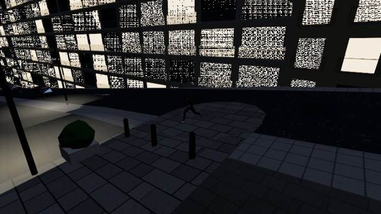 |
| 🆕 | -3127 | 24 | service (#4918) | zona nueva | en coche | Un edificio tapa la vía: la calle entra en él (dato de OSM o edificio mal puesto) | 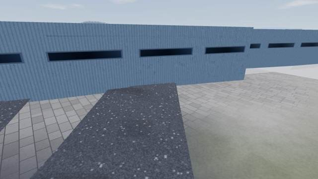 |
| 🆕 | -3113 | 18 | service (#4919) | zona nueva | en coche | Un edificio tapa la vía: la calle entra en él (dato de OSM o edificio mal puesto) | 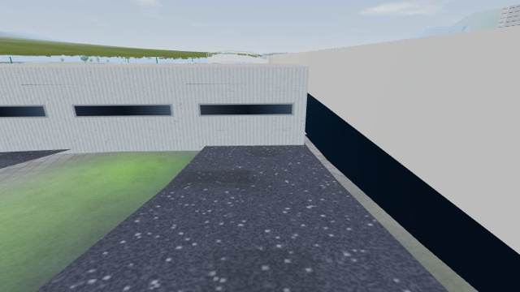 |
| 🆕 | -3072 | -67 | service (#5020) | zona nueva | en coche | Un edificio tapa la vía: la calle entra en él (dato de OSM o edificio mal puesto) | 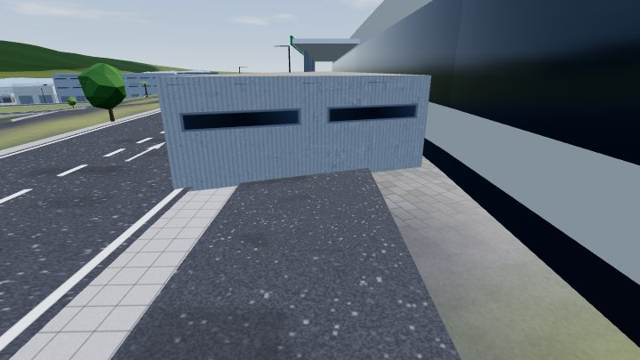 |
| 🆕 | 804 | 904 | footway (#1990) | zona nueva | a pie | Un edificio tapa el camino | 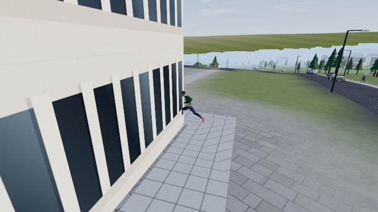 |
| 🆕 | -3126 | 36 | footway (#4935) | zona nueva | a pie | Un edificio tapa el camino | 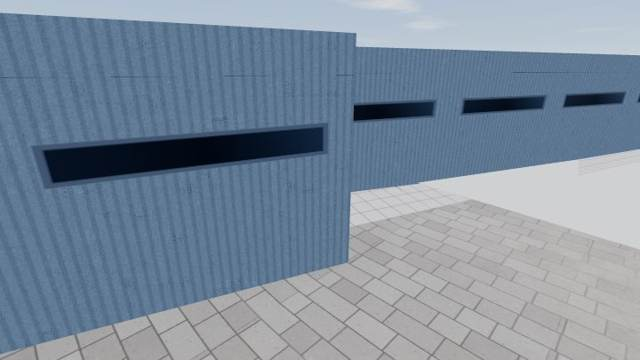 |
