# Revisión de jugabilidad — v0.48.0 (2026-10-06 2008)

Agente revisor automático. Estado: **terminado**. Tiempo: 1089 s.

- Zonas nuevas de esta versión: .
- Plan: surf 692, walk 83, drive 692.
- Comparado con: revision_v0.47.0_2026-10-06_1859.json.

**130 avisos: 32 nuevos, 98 siguen; 2 arreglados desde el informe anterior.**

## Arreglados

| X | Z | Vía | Tipo |
|---|---|---|---|
| 441 | -343 | Vía de Ronda de La Laguna (#1609) | Vuela sobre la calzada |
| 2192 | 3558 | Autopista del Norte (#4544) | Vuela sobre la calzada |

## Vuela sobre la calzada (40)

| | X | Z | Vía | Pasada | Prueba | Detalle | Captura |
|---|---|---|---|---|---|---|---|
| 🆕 | 801 | 3484 | Avenida Ghandi (#1229) | riesgo | en coche | El coche va 1.0 m por encima de la calzada | 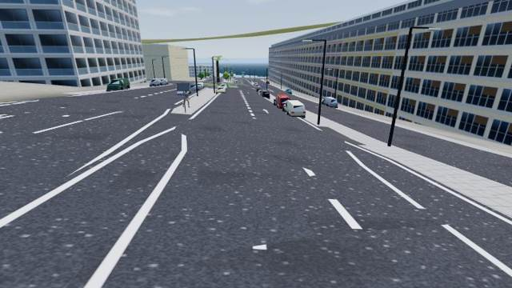 |
| 🆕 | 802 | 3487 | Travesía Enlace Andenes Sobradillo (#1228) | rotación | en coche | El coche va 1.1 m por encima de la calzada | 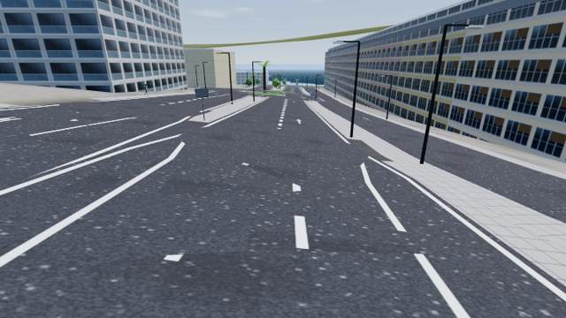 |
| ↻ | -2221 | -212 | motorway_link (#307) | riesgo | en coche | El coche va 1.8 m por encima de la calzada | 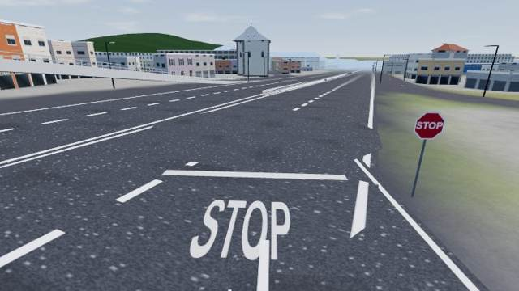 |
| ↻ | 780 | 3438 | tertiary (#398) | riesgo | en coche | El coche va 1.2 m por encima de la calzada | 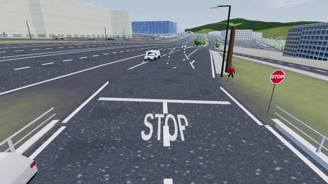 |
| ↻ | 750 | 3486 | motorway_link (#399) | riesgo | en coche | El coche va 1.1 m por encima de la calzada | 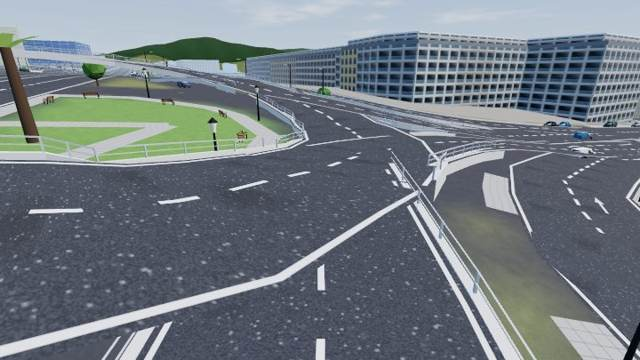 |
| ↻ | 662 | 3432 | Travesía Enlace Andenes Sobradillo (#650) | riesgo | en coche | El coche va 1.0 m por encima de la calzada | 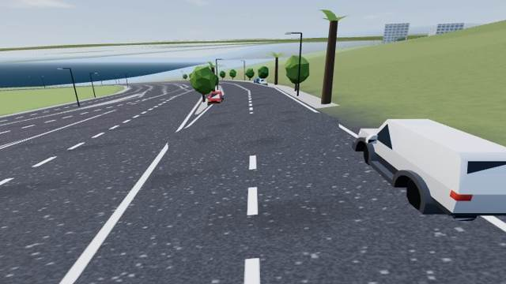 |
| ↻ | 674 | 3445 | motorway_link (#651) | riesgo | en coche | El coche va 1.0 m por encima de la calzada | 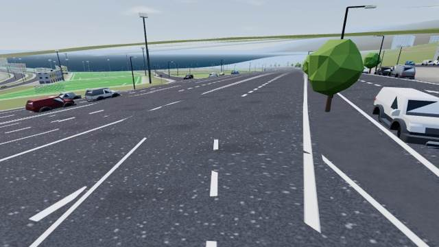 |
| ↻ | 159 | 1198 | secondary (#660) | riesgo | en coche | El coche va 1.2 m por encima de la calzada | 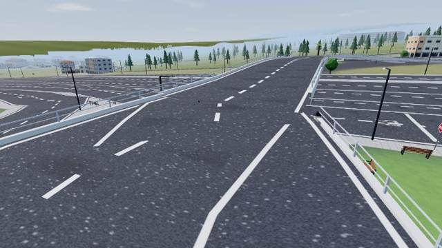 |
| ↻ | 742 | 840 | primary_link (#668) | riesgo | en coche | El coche va 2.5 m por encima de la calzada | 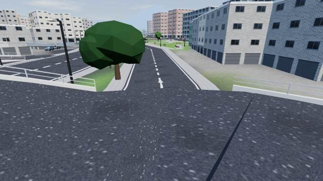 |
| ↻ | 173 | 1191 | secondary (#694) | riesgo | en coche | El coche va 1.0 m por encima de la calzada | 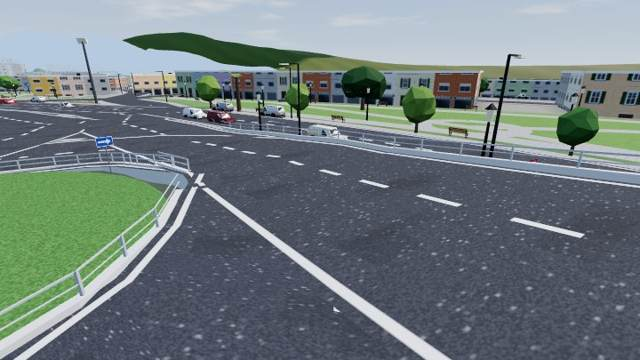 |
| ↻ | 2226 | 3568 | motorway_link (#718) | riesgo | en coche | El coche va 1.4 m por encima de la calzada | 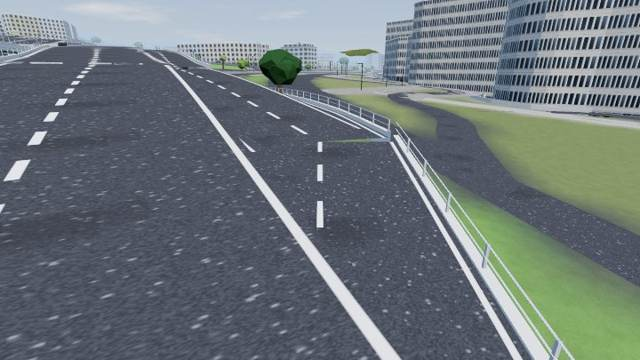 |
| ↻ | 1174 | 2433 | motorway_link (#728) | riesgo | en coche | El coche va 1.2 m por encima de la calzada | 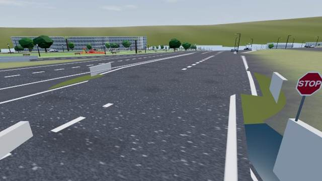 |
| ↻ | 721 | 3389 | motorway_link (#824) | riesgo | en coche | El coche va 1.1 m por encima de la calzada | 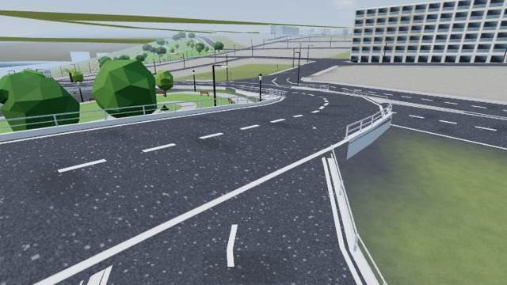 |
| ↻ | 318 | 231 | primary_link (#840) | riesgo | en coche | El coche va 2.3 m por encima de la calzada | 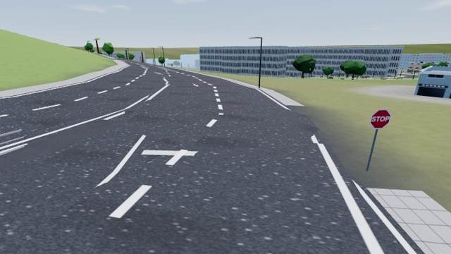 |
| ↻ | 800 | 3474 | Avenida Ghandi (#1225) | riesgo | en coche | El coche va 1.0 m por encima de la calzada | 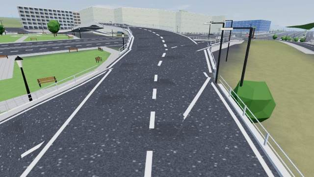 |
| ↻ | 2203 | 3575 | motorway_link (#1304) | riesgo | en coche | El coche va 1.0 m por encima de la calzada | 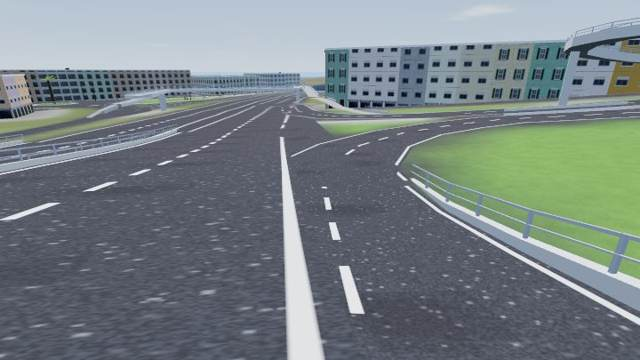 |
| ↻ | 2199 | 3565 | Autopista del Norte (#1306) | riesgo | en coche | El coche va 1.0 m por encima de la calzada | 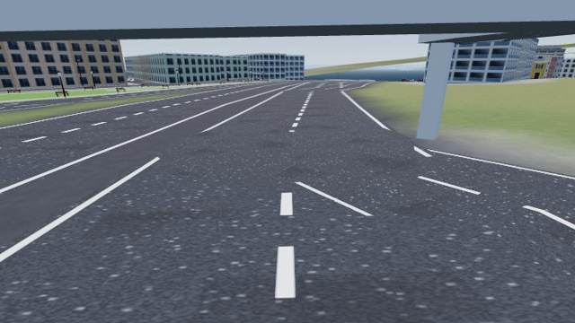 |
| ↻ | -838 | 1351 | Carretera de La Esperanza (#1369) | riesgo | en coche | El coche va 1.4 m por encima de la calzada | 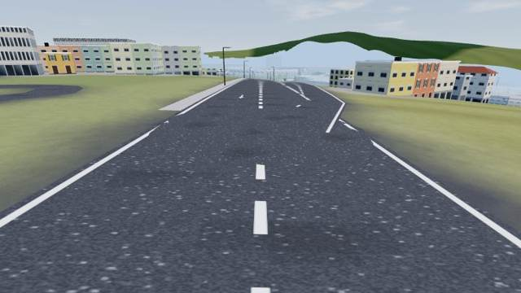 |
| ↻ | 702 | 813 | residential (#1527) | riesgo | en coche | El coche va 3.7 m por encima de la calzada | 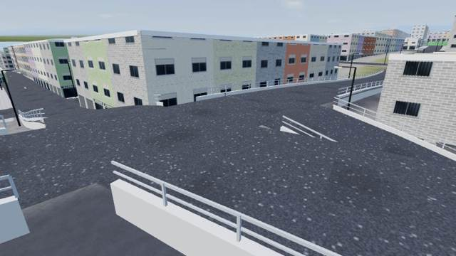 |
| ↻ | 408 | -312 | primary_link (#1607) | riesgo | en coche | El coche va 1.6 m por encima de la calzada | 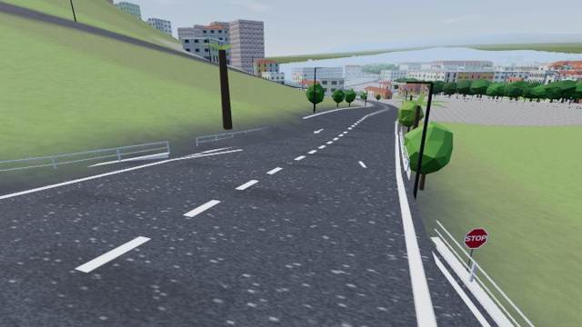 |
| ↻ | 401 | -294 | primary_link (#1608) | riesgo | en coche | El coche va 1.0 m por encima de la calzada | 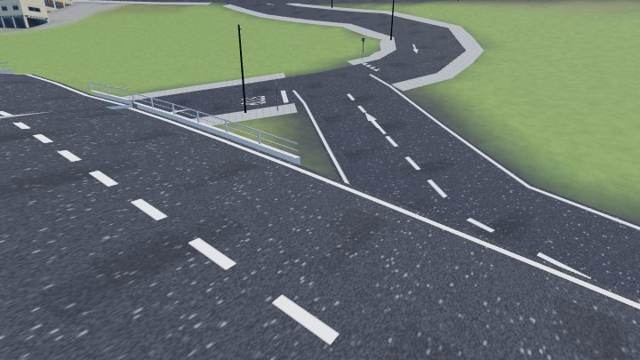 |
| ↻ | 416 | -313 | Vía de Ronda de La Laguna (#1610) | riesgo | en coche | El coche va 1.0 m por encima de la calzada | 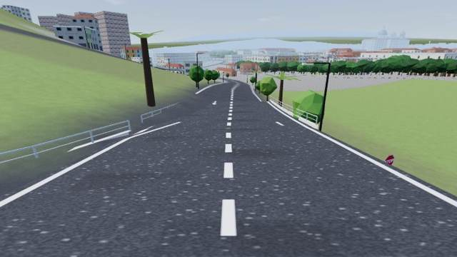 |
| ↻ | 328 | 18 | Vía de Ronda de La Laguna (#1975) | riesgo | en coche | El coche va 1.0 m por encima de la calzada | 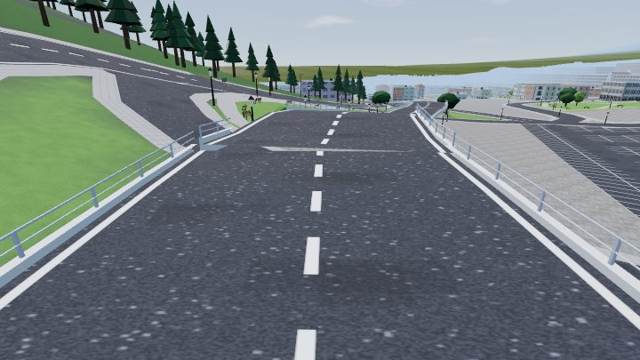 |
| ↻ | 2226 | 3568 | Autopista del Norte (#2320) | riesgo | en coche | El coche va 1.3 m por encima de la calzada | 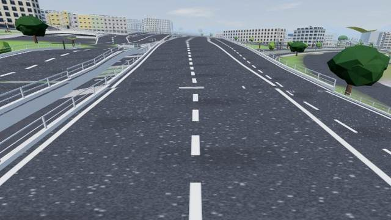 |
| ↻ | 2238 | 3583 | Autopista del Norte (#2322) | riesgo | en coche | El coche va 1.0 m por encima de la calzada | 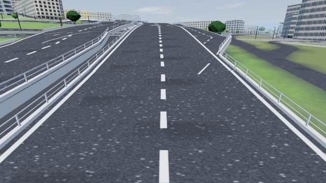 |
| ↻ | 2219 | 3542 | motorway_link (#2333) | riesgo | en coche | El coche va 1.1 m por encima de la calzada | 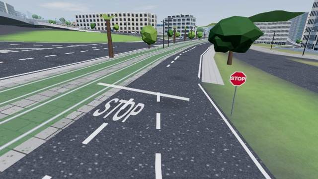 |
| ↻ | 742 | 842 | unclassified (#2410) | riesgo | en coche | El coche va 1.4 m por encima de la calzada | 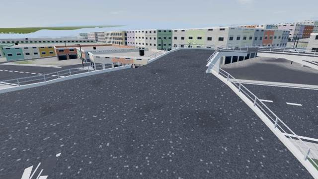 |
| ↻ | 686 | 3385 | tertiary (#2421) | riesgo | en coche | El coche va 1.4 m por encima de la calzada | 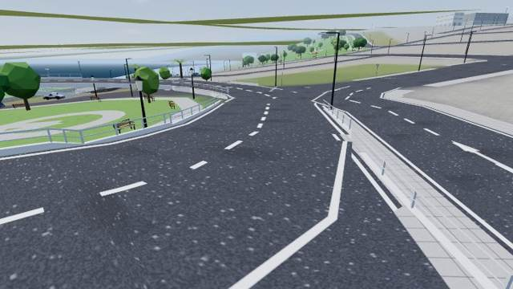 |
| ↻ | 780 | 3440 | tertiary (#2428) | riesgo | en coche | El coche va 1.2 m por encima de la calzada | 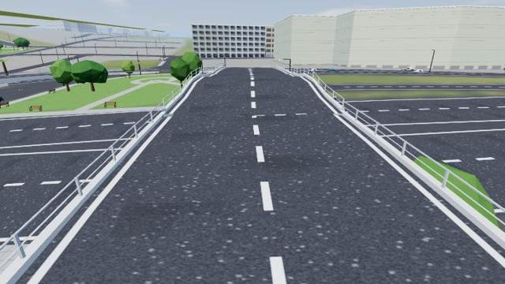 |
| ↻ | 778 | 3463 | tertiary (#2430) | riesgo | en coche | El coche va 1.0 m por encima de la calzada | 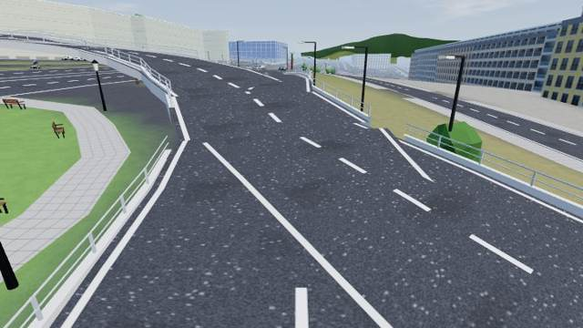 |
| ↻ | 1179 | 2326 | tertiary (#2547) | riesgo | en coche | El coche va 1.0 m por encima de la calzada | 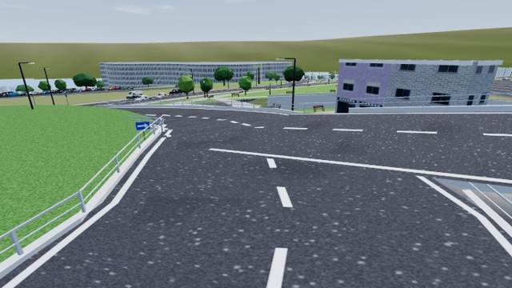 |
| ↻ | 330 | 95 | Vía de Ronda de La Laguna (#2566) | riesgo | en coche | El coche va 1.0 m por encima de la calzada | 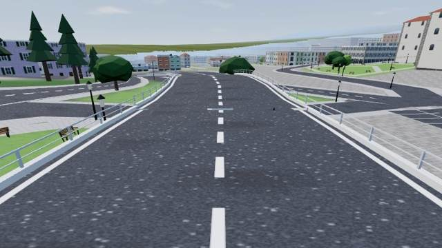 |
| ↻ | -495 | 683 | service (#2696) | riesgo | en coche | El coche va 1.3 m por encima de la calzada | 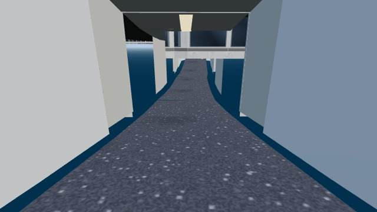 |
| ↻ | 86 | 1292 | secondary (#3532) | riesgo | en coche | El coche va 1.4 m por encima de la calzada | 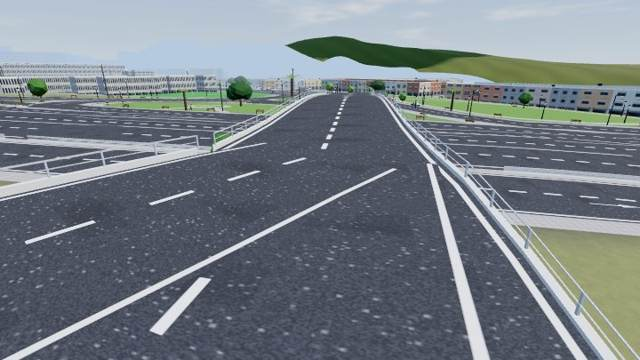 |
| ↻ | -371 | 811 | primary_link (#3612) | riesgo | en coche | El coche va 1.0 m por encima de la calzada | 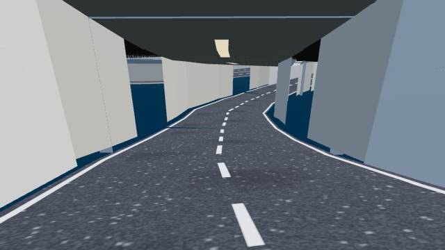 |
| ↻ | 2161 | 3524 | Autopista del Norte (#4545) | riesgo | en coche | El coche va 1.1 m por encima de la calzada | 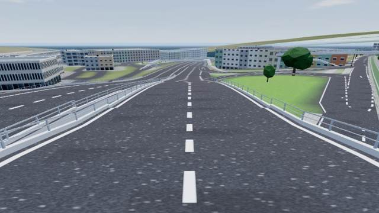 |
| ↻ | -2251 | -267 | secondary (#4686) | riesgo | en coche | El coche va 1.1 m por encima de la calzada | 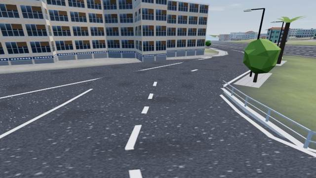 |
| ↻ | -2274 | -282 | Carretera General del Norte (#4728) | riesgo | en coche | El coche va 1.5 m por encima de la calzada | 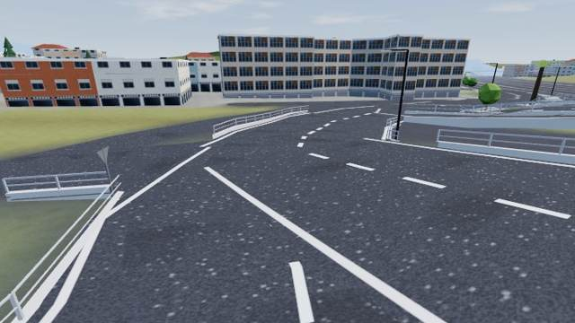 |
| ↻ | -2301 | -235 | primary (#4732) | riesgo | en coche | El coche va 1.1 m por encima de la calzada | 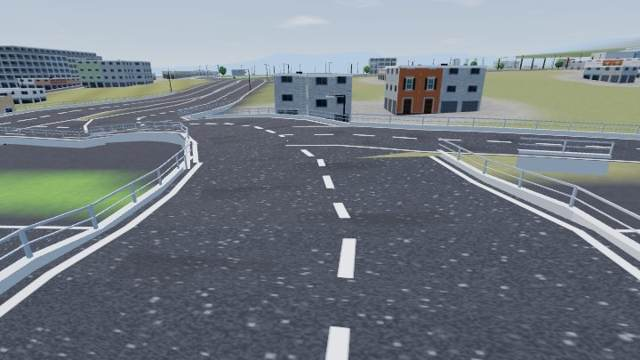 |
| ↻ | -2270 | -257 | primary (#4857) | riesgo | en coche | El coche va 1.0 m por encima de la calzada | 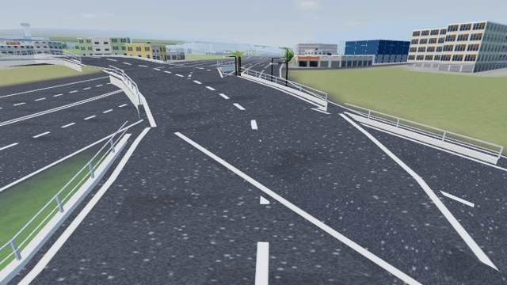 |

## Atascos (28)

| | X | Z | Vía | Pasada | Prueba | Detalle | Captura |
|---|---|---|---|---|---|---|---|
| 🆕 | 2400 | 2721 | Carretera General La Cuesta - Taco (#1074) | rotación | en coche | El coche se queda atascado | 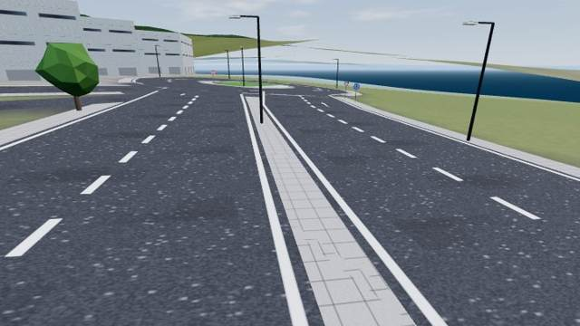 |
| 🆕 | 2400 | 1285 | Calle Bentejuí (#1098) | rotación | en coche | El coche se queda atascado | 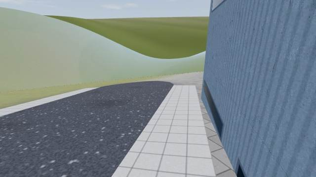 |
| 🆕 | 2400 | 1216 | Calle las Casas (#1108) | rotación | en coche | El coche se queda atascado | 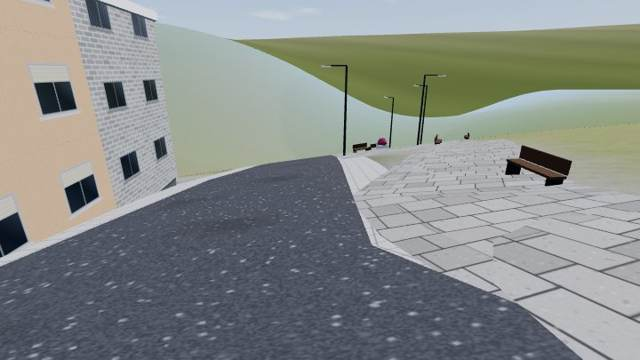 |
| 🆕 | 1462 | 1177 | Calle Albacete (#1110) | rotación | en coche | El coche se queda atascado contra un obstáculo/muro | 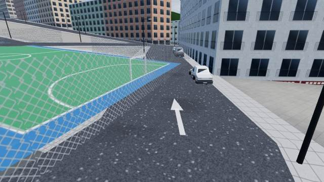 |
| 🆕 | 1433 | 1154 | Calle Cartagena (#1124) | rotación | en coche | El coche se queda atascado contra un obstáculo/muro | 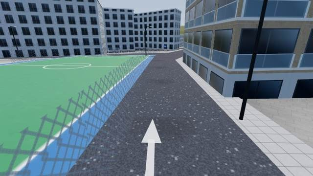 |
| 🆕 | 533 | 3980 | Autovía Interconexión Norte-Sur (#1164) | rotación | en coche | El coche se queda atascado | 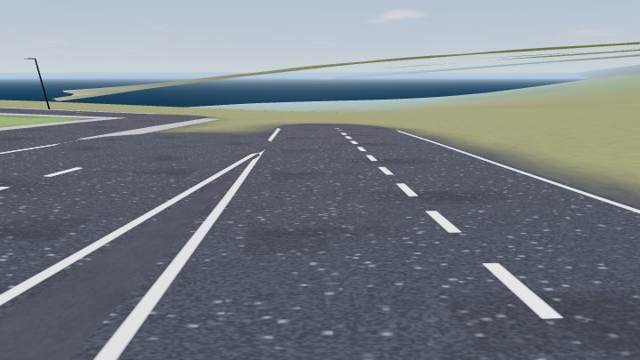 |
| 🆕 | 319 | 1479 | Autopista del Norte (#1281) | rotación | en coche | El coche se queda atascado contra un obstáculo/muro | 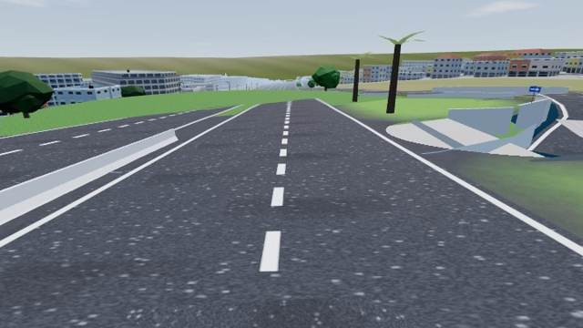 |
| 🆕 | 2400 | 1143 | residential (#1307) | rotación | en coche | El coche se queda atascado | 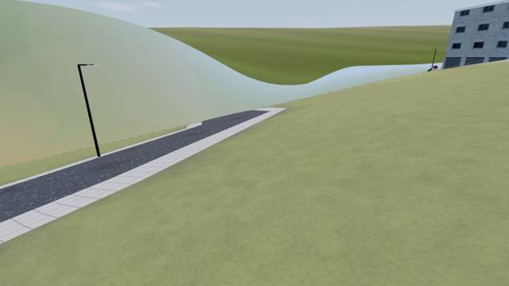 |
| 🆕 | 2400 | 1582 | Calle Embudo (#1309) | rotación | en coche | El coche se queda atascado | 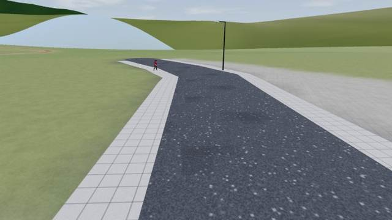 |
| 🆕 | 2400 | 3124 | Madagascar (#1315) | rotación | en coche | El coche se queda atascado | 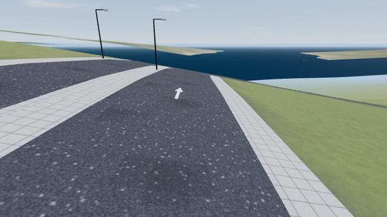 |
| 🆕 | 2400 | 2386 | service (#1317) | rotación | en coche | El coche se queda atascado | 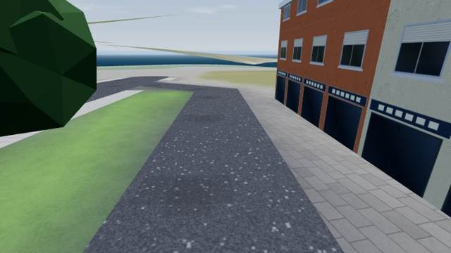 |
| 🆕 | 2400 | 2371 | Avenida Ingenieros (#1318) | rotación | en coche | El coche se queda atascado | 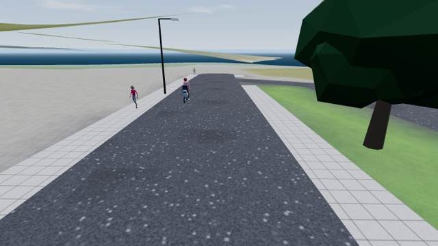 |
| 🆕 | 1950 | 3132 | Calle Zerolo (#1346) | rotación | en coche | El coche se queda atascado | 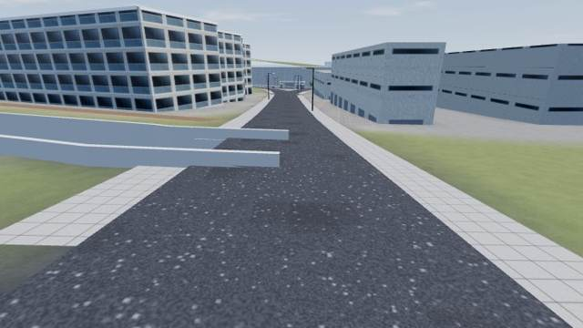 |
| 🆕 | 2400 | 1694 | Calle la Calma (#1374) | rotación | en coche | El coche se queda atascado | 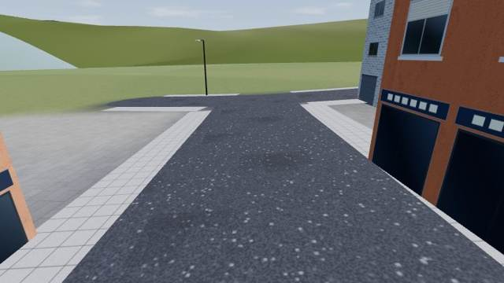 |
| ↻ | 2150 | 3200 | unclassified (#364) | riesgo | en coche | El coche se queda atascado | 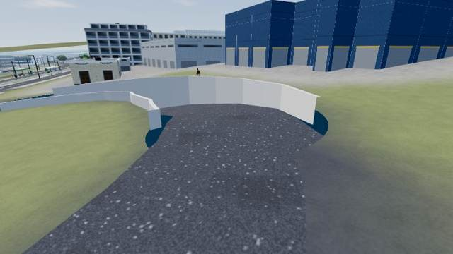 |
| ↻ | 375 | 1456 | Vía de Ronda de La Laguna (#446) | riesgo | en coche | El coche se queda atascado | 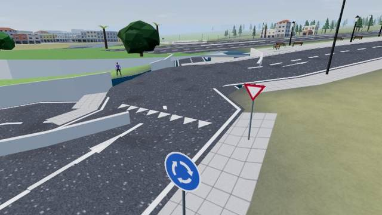 |
| ↻ | 741 | 837 | primary_link (#668) | riesgo | en coche | El coche se queda atascado |  |
| ↻ | 392 | 1475 | Vía de Ronda de La Laguna (#724) | riesgo | en coche | El coche se queda atascado | 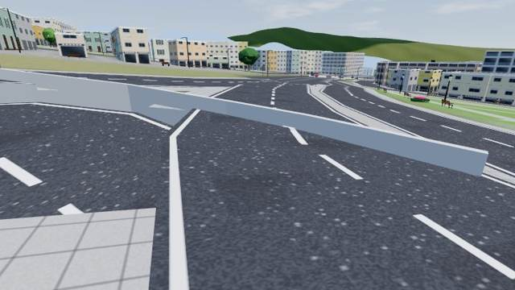 |
| ↻ | 1823 | 3077 | tertiary (#913) | riesgo | en coche | El coche se queda atascado | 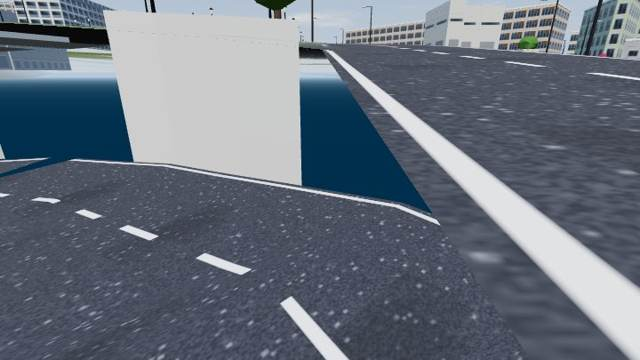 |
| ↻ | 1802 | 3160 | tertiary (#932) | riesgo | en coche | El coche se queda atascado | 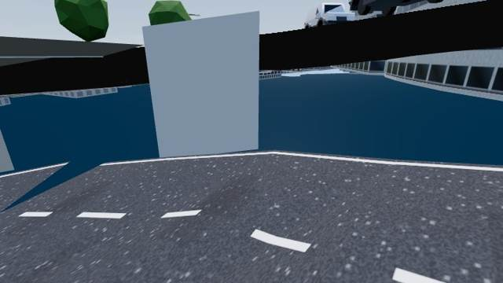 |
| ↻ | 734 | 1288 | Vía de Ronda de La Laguna (#1022) | riesgo | en coche | El coche se queda atascado | 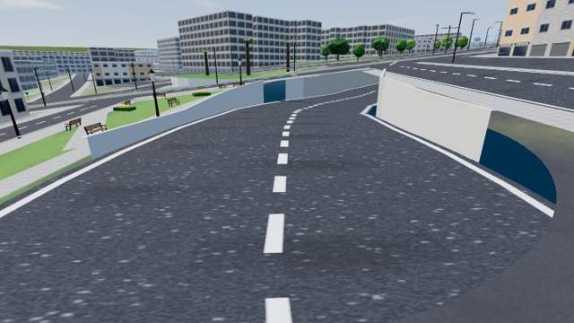 |
| ↻ | 697 | 836 | residential (#1527) | riesgo | en coche | El coche se queda atascado |  |
| ↻ | 1987 | 3980 | service (#1580) | riesgo | en coche | El coche se queda atascado | 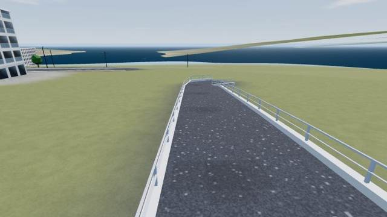 |
| ↻ | 429 | -321 | primary_link (#1608) | riesgo | en coche | El coche se queda atascado |  |
| ↻ | 1766 | 3140 | tertiary (#2250) | riesgo | en coche | El coche se queda atascado | 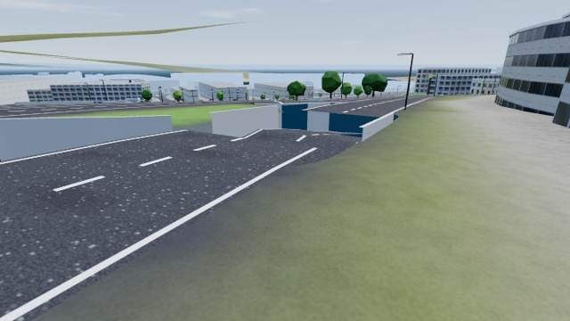 |
| ↻ | 303 | 1535 | primary (#2415) | riesgo | en coche | El coche se queda atascado | 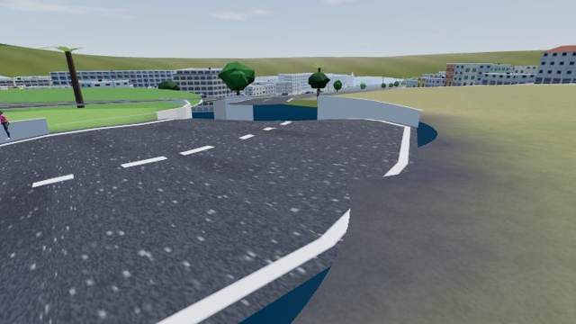 |
| ↻ | 1943 | 3057 | service (#3018) | riesgo | en coche | El coche se queda atascado | 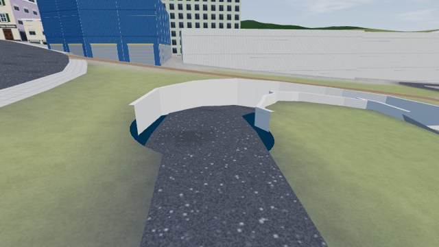 |
| ↻ | 797 | 3132 | Calle Aceviño (#3192) | riesgo | en coche | El coche se queda atascado | 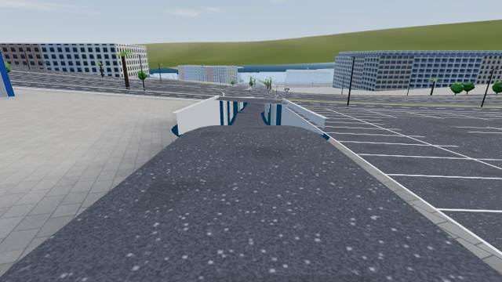 |

## Se hunde (19)

| | X | Z | Vía | Pasada | Prueba | Detalle | Captura |
|---|---|---|---|---|---|---|---|
| 🆕 | -987 | -235 | footway (#2244) | rotación | a pie | El personaje se hunde 0.59 m bajo la superficie visible (suelo) | 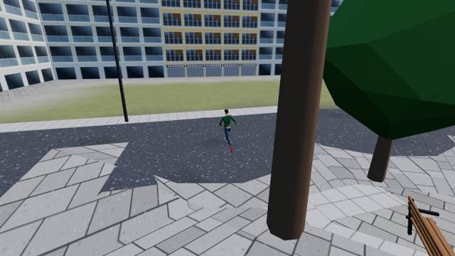 |
| 🆕 | 1674 | 3777 | footway (#2389) | rotación | a pie | El personaje se hunde 0.28 m bajo la superficie visible (grass) | 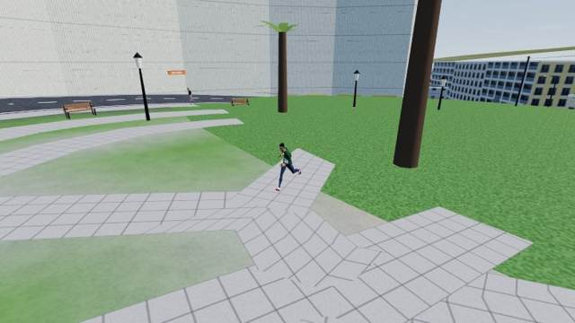 |
| 🆕 | 1680 | 3782 | footway (#2390) | rotación | a pie | El personaje se hunde 0.59 m bajo la superficie visible (grass) | 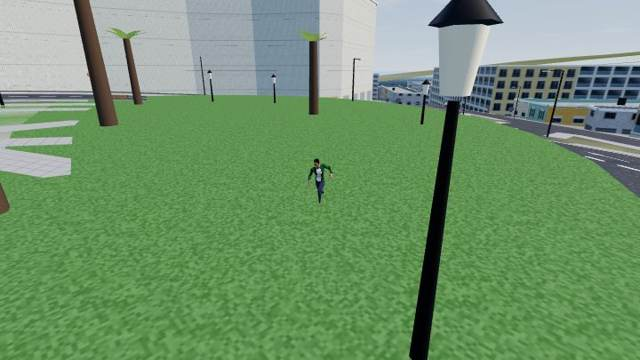 |
| 🆕 | 1686 | 3778 | footway (#2391) | rotación | a pie | El personaje se hunde 0.27 m bajo la superficie visible (grass) | 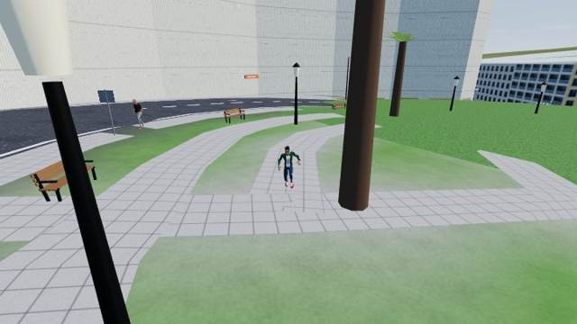 |
| 🆕 | 1656 | 3777 | footway (#2392) | rotación | a pie | El personaje se hunde 0.38 m bajo la superficie visible (grass) | 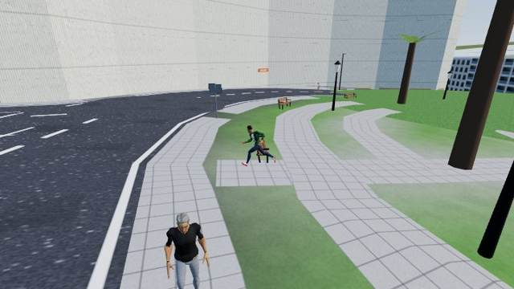 |
| 🆕 | 684 | 3459 | path (#2554) | rotación | a pie | El personaje se hunde 0.94 m bajo la superficie visible (trim) | 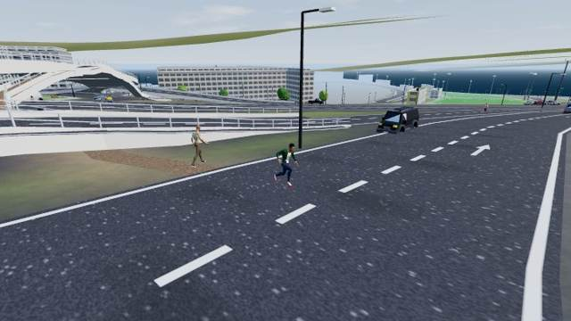 |
| 🆕 | 1713 | 2215 | path (#2613) | rotación | a pie | El personaje se hunde 0.83 m bajo la superficie visible (suelo) | 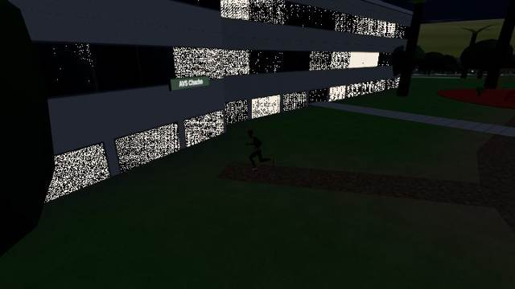 |
| ↻ | 501 | 1386 | Vía de Ronda de La Laguna (#443) | riesgo | en coche | El coche va 0.5 m por debajo de la calzada | 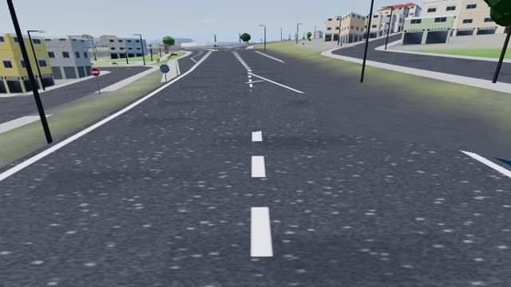 |
| ↻ | 389 | 1487 | Vía de Ronda de La Laguna (#724) | riesgo | en coche | El coche va 2.4 m por debajo de la calzada |  |
| ↻ | 1837 | 3084 | tertiary (#913) | riesgo | en coche | El coche va 1.6 m por debajo de la calzada |  |
| ↻ | 1846 | 3102 | tertiary (#922) | riesgo | en coche | El coche va 0.5 m por debajo de la calzada | 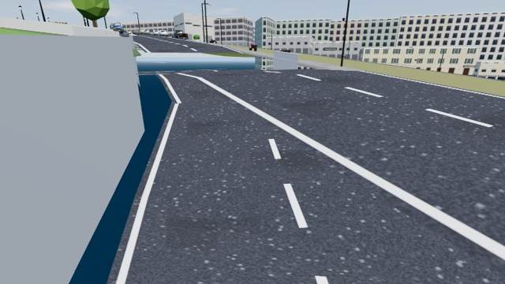 |
| ↻ | 1785 | 3153 | tertiary (#932) | riesgo | en coche | El coche va 1.1 m por debajo de la calzada |  |
| ↻ | 1854 | 3104 | tertiary (#1311) | riesgo | en coche | El coche va 1.4 m por debajo de la calzada | 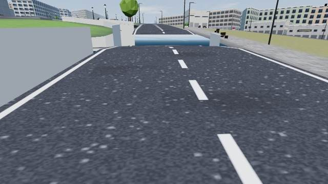 |
| ↻ | 385 | 1477 | primary (#2386) | riesgo | en coche | El coche va 0.5 m por debajo de la calzada | 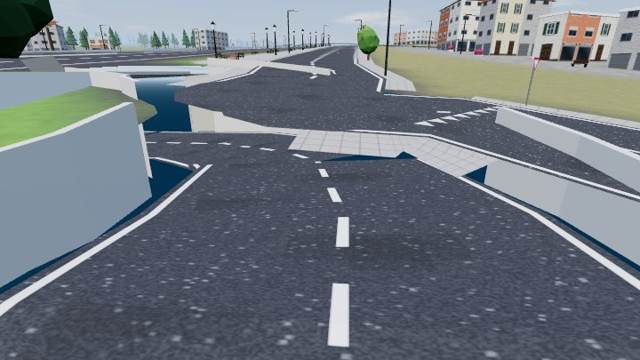 |
| ↻ | 307 | 1536 | primary (#2415) | riesgo | en coche | El coche va 0.5 m por debajo de la calzada |  |
| ↻ | -975 | 121 | tertiary (#3046) | riesgo | en coche | El coche va 0.7 m por debajo de la calzada | 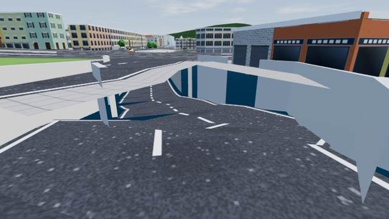 |
| ↻ | -394 | 834 | primary_link (#3612) | riesgo | en coche | El coche va 0.6 m por debajo de la calzada |  |
| ↻ | 1431 | 1659 | secondary (#3688) | riesgo | en coche | El coche va 0.5 m por debajo de la calzada | 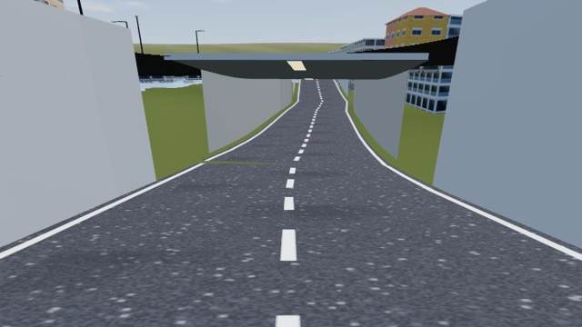 |
| ↻ | -3872 | -358 | service (#5126) | riesgo | en coche | El coche va 0.5 m por debajo de la calzada | 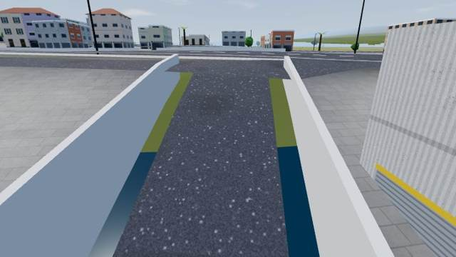 |

## Objetos flotando sobre la calzada (18)

| | X | Z | Vía | Pasada | Prueba | Detalle | Captura |
|---|---|---|---|---|---|---|---|
| 🆕 | 348 | 1511 | Autopista del Norte (#1281) | rotación | superficies | Algo plano («grass») flota 0.6 m sobre la calzada | 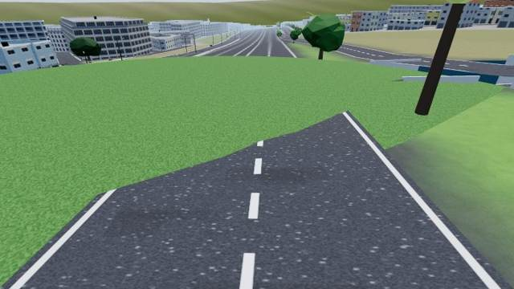 |
| 🆕 | 1908 | 3125 | Calle Zerolo (#1346) | rotación | superficies | Algo plano («trim») flota 0.8 m sobre la calzada | 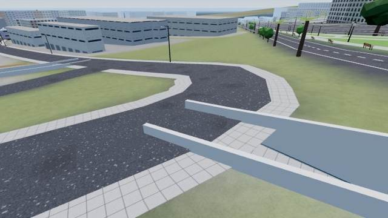 |
| ↻ | 752 | 1268 | primary_link (#19) | riesgo | superficies | Algo plano («asphaltLines») flota 1.0 m sobre la calzada | 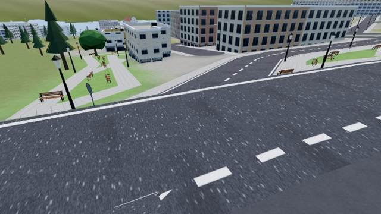 |
| ↻ | -2225 | -213 | motorway_link (#307) | riesgo | superficies | Algo plano («trim») flota 3.1 m sobre la calzada | 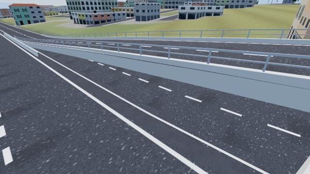 |
| ↻ | 753 | 3484 | motorway_link (#399) | riesgo | superficies | Algo plano («asphaltLines») flota 1.2 m sobre la calzada | 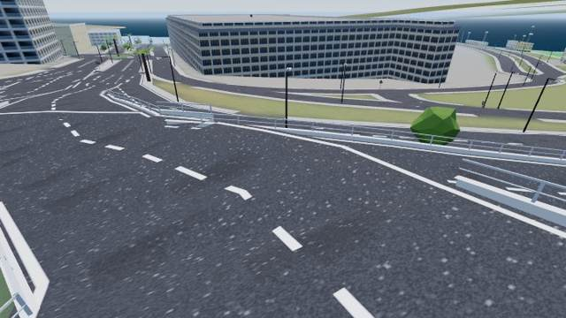 |
| ↻ | 885 | 3177 | tertiary_link (#400) | riesgo | superficies | Algo plano («trim») flota 0.7 m sobre la calzada | 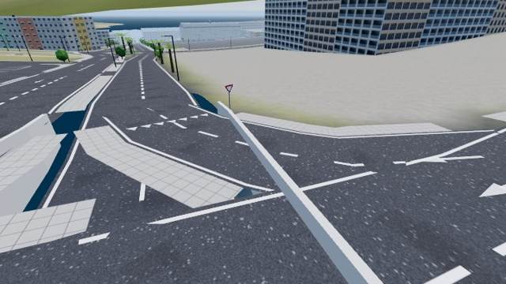 |
| ↻ | 742 | 838 | primary_link (#668) | riesgo | superficies | Algo plano («asphalt») flota 1.8 m sobre la calzada | 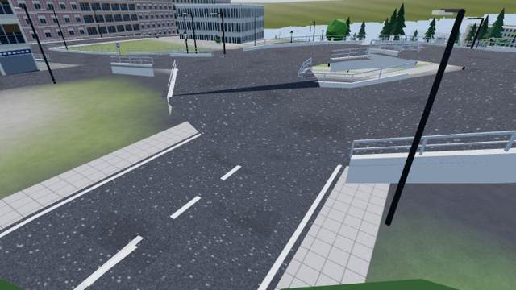 |
| ↻ | 464 | 1421 | primary_link (#813) | riesgo | superficies | Algo plano («asphaltLines») flota 0.8 m sobre la calzada | 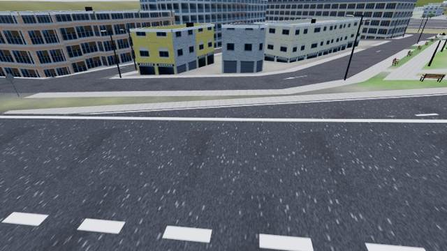 |
| ↻ | 714 | 3392 | motorway_link (#824) | riesgo | superficies | Algo plano («trim») flota 0.7 m sobre la calzada | 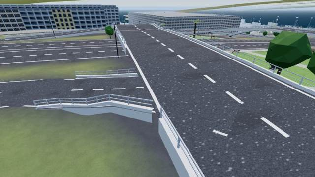 |
| ↻ | 320 | 238 | primary_link (#840) | riesgo | superficies | Algo plano («asphaltLines») flota 1.4 m sobre la calzada | 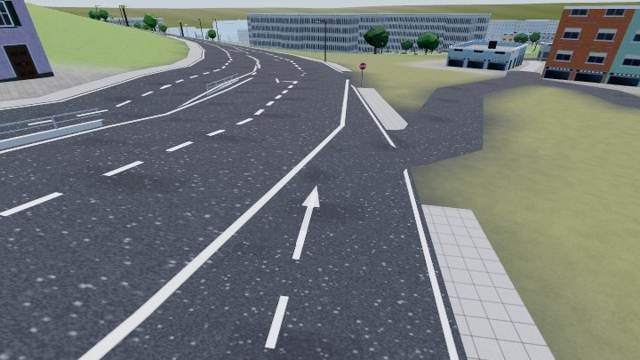 |
| ↻ | -741 | 334 | tertiary (#979) | riesgo | superficies | Algo plano («asphaltLines») flota 1.9 m sobre la calzada | 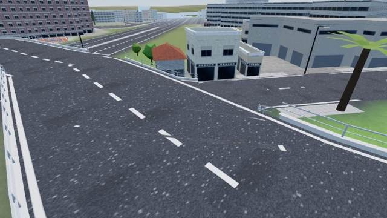 |
| ↻ | 1512 | 1744 | Avenida de los Menceyes (#1052) | riesgo | superficies | Algo plano («trim») flota 0.7 m sobre la calzada | 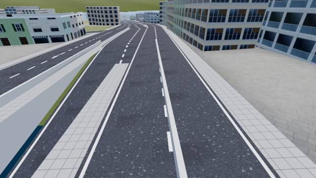 |
| ↻ | 701 | 814 | residential (#1527) | riesgo | superficies | Algo plano («trim») flota 2.8 m sobre la calzada | 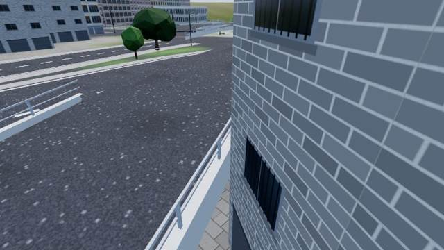 |
| ↻ | 410 | -314 | primary_link (#1607) | riesgo | superficies | Algo plano («trim») flota 3.2 m sobre la calzada | 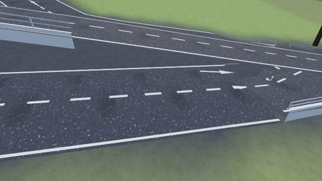 |
| ↻ | -731 | 335 | Camino San Francisco (#2831) | riesgo | superficies | Algo plano («asphaltLines») flota 2.0 m sobre la calzada | 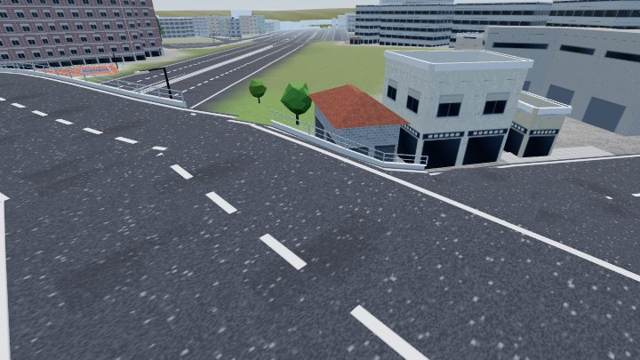 |
| ↻ | 91 | 1284 | secondary (#3532) | riesgo | superficies | Algo plano («trim») flota 1.9 m sobre la calzada | 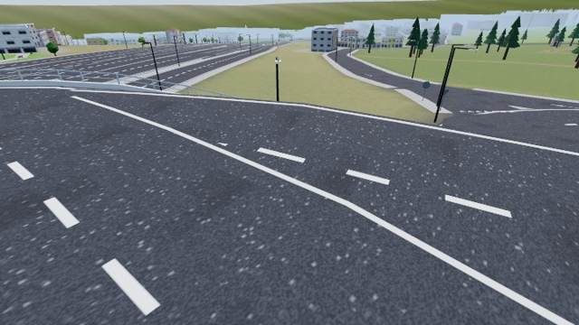 |
| ↻ | -3273 | -237 | secondary_link (#4772) | riesgo | superficies | Algo plano («trim») flota 0.7 m sobre la calzada | 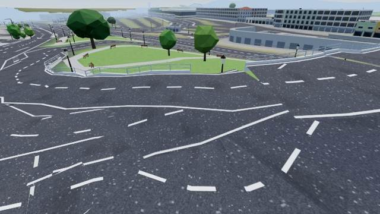 |
| ↻ | -3282 | -233 | secondary (#5016) | riesgo | superficies | Algo plano («trim») flota 0.8 m sobre la calzada | 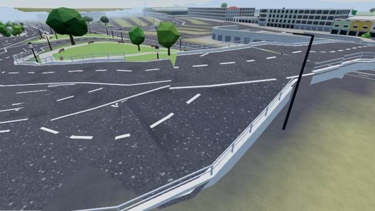 |

## Texturas cruzadas (suelo sobre la carretera) (11)

| | X | Z | Vía | Pasada | Prueba | Detalle | Captura |
|---|---|---|---|---|---|---|---|
| 🆕 | 344 | 1506 | Autopista del Norte (#1281) | rotación | superficies | Superficie «grass» 0.18 m por encima del asfalto |  |
| ↻ | -2189 | -214 | motorway_link (#307) | riesgo | superficies | Superficie «trim» 0.18 m por encima del asfalto |  |
| ↻ | 662 | 3433 | Travesía Enlace Andenes Sobradillo (#650) | riesgo | superficies | Superficie «trim» 0.17 m por encima del asfalto | 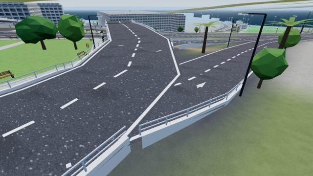 |
| ↻ | 674 | 3446 | motorway_link (#651) | riesgo | superficies | Superficie «trim» 0.21 m por encima del asfalto | 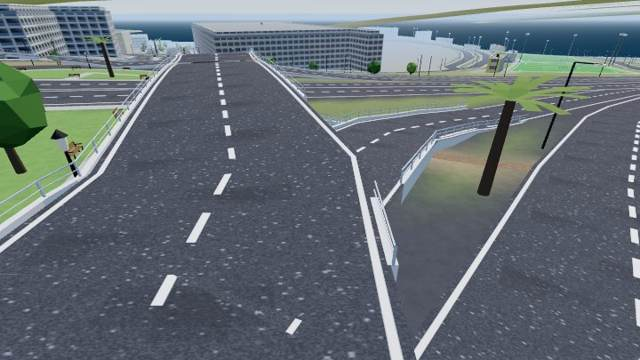 |
| ↻ | 177 | 1191 | secondary (#694) | riesgo | superficies | Superficie «trim» 0.24 m por encima del asfalto | 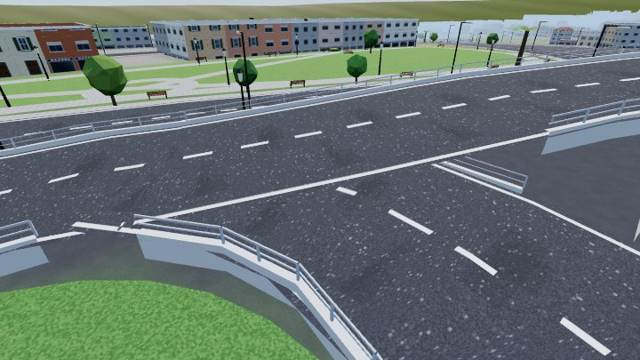 |
| ↻ | 323 | 242 | primary_link (#840) | riesgo | superficies | Superficie «trim» 0.26 m por encima del asfalto |  |
| ↻ | 2216 | 3537 | motorway_link (#2333) | riesgo | superficies | Superficie «trim» 0.35 m por encima del asfalto | 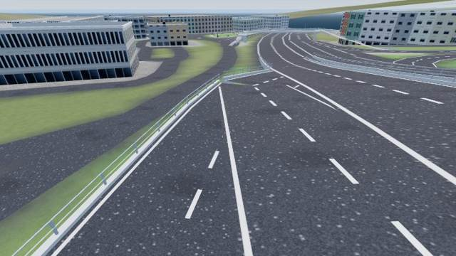 |
| ↻ | 95 | 1279 | secondary (#3532) | riesgo | superficies | Superficie «trim» 0.28 m por encima del asfalto |  |
| ↻ | 77 | 1287 | secondary (#3537) | riesgo | superficies | Superficie «trim» 0.23 m por encima del asfalto | 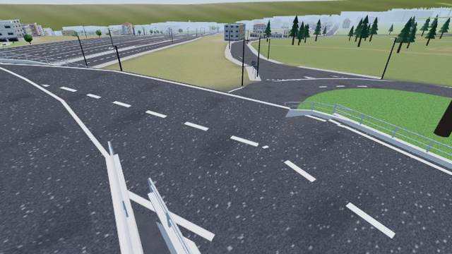 |
| ↻ | -2273 | -283 | Carretera General del Norte (#4728) | riesgo | superficies | Superficie «trim» 0.11 m por encima del asfalto | 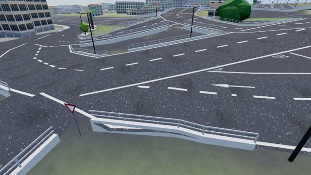 |
| ↻ | -3274 | -236 | secondary_link (#4772) | riesgo | superficies | Superficie «trim» 0.19 m por encima del asfalto |  |

## Se sale de la calzada (7)

| | X | Z | Vía | Pasada | Prueba | Detalle | Captura |
|---|---|---|---|---|---|---|---|
| 🆕 | 2356 | 1164 | residential (#1113) | rotación | en coche | El coche se sale de la calzada (7.1 m del eje) | 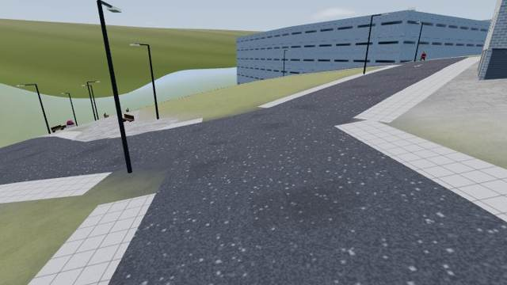 |
| 🆕 | -307 | 852 | Rambla Las Clavellinas (#1186) | rotación | en coche | El coche se sale de la calzada (7.2 m del eje) | 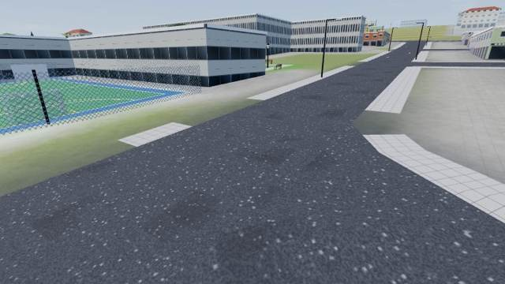 |
| 🆕 | -695 | 994 | service (#1188) | rotación | en coche | El coche se sale de la calzada (5.6 m del eje) | 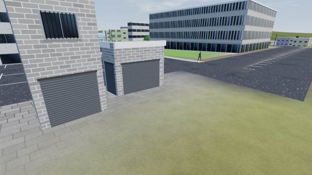 |
| 🆕 | 2400 | 1136 | residential (#1307) | rotación | en coche | El coche se sale de la calzada (7.0 m del eje) |  |
| 🆕 | 2358 | 944 | service (#1308) | rotación | en coche | El coche se sale de la calzada (5.8 m del eje) | 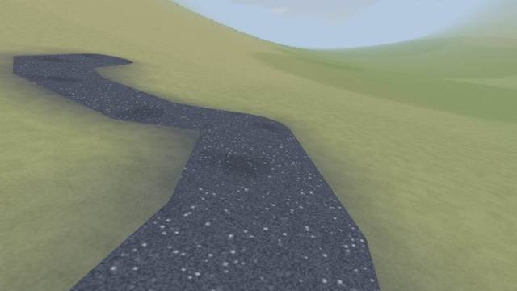 |
| ↻ | 1801 | 3160 | tertiary (#932) | riesgo | en coche | El coche se sale de la calzada (8.2 m del eje) |  |
| ↻ | 698 | 833 | residential (#1527) | riesgo | en coche | El coche se sale de la calzada (7.0 m del eje) |  |

## Saltos de altura (5)

| | X | Z | Vía | Pasada | Prueba | Detalle | Captura |
|---|---|---|---|---|---|---|---|
| ↻ | -2221 | -212 | motorway_link (#307) | riesgo | en coche | Salto brusco de altura (1.6 m en un fotograma) |  |
| ↻ | 318 | 231 | primary_link (#840) | riesgo | en coche | Salto brusco de altura (2.2 m en un fotograma) |  |
| ↻ | 702 | 813 | residential (#1527) | riesgo | en coche | Salto brusco de altura (1.8 m en un fotograma) |  |
| ↻ | 408 | -312 | primary_link (#1607) | riesgo | en coche | Salto brusco de altura (1.4 m en un fotograma) |  |
| ↻ | -495 | 683 | service (#2696) | riesgo | en coche | Salto brusco de altura (-1.2 m en un fotograma) |  |

## Edificios sobre la vía (2)

| | X | Z | Vía | Pasada | Prueba | Detalle | Captura |
|---|---|---|---|---|---|---|---|
| 🆕 | -631 | 997 | service (#1188) | rotación | en coche | Un edificio tapa la vía: la calle entra en él (dato de OSM o edificio mal puesto) |  |
| ↻ | 543 | -909 | Camino La Rúa (#306) | riesgo | en coche | Un edificio tapa la vía: la calle entra en él (dato de OSM o edificio mal puesto) | 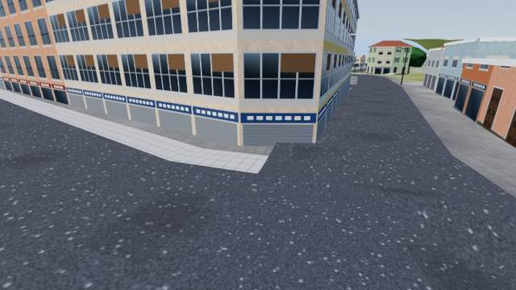 |
